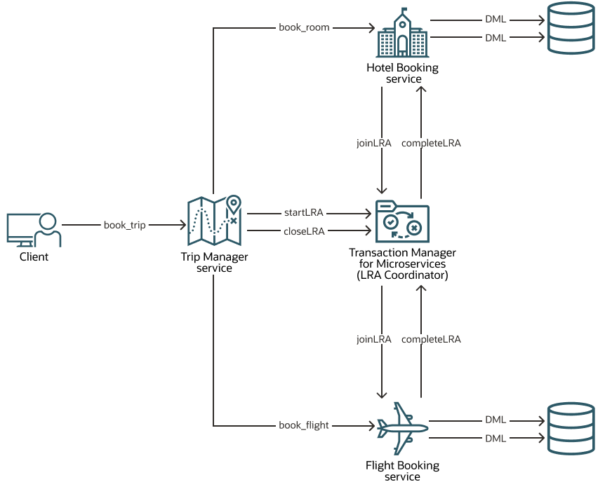

**Table of Contents**

<!-- TOC start (generated with https://github.com/derlin/bitdowntoc) -->

- [About the Trip Booking Application](#about-the-trip-booking-application)
- [Repository Structure for the Trip Booking Application](#repository-structure-for-the-trip-booking-application)

<!-- TOC end -->

# About the Trip Booking Application

The Trip Booking application contains several microservices that interact with each other to complete a transaction. Run this application to book a trip, which consists of booking a hotel room and a flight. Each microservice in the Trip Booking application performs a different task. One microservice books a trip, another books a flight, and a third microservice books a hotel. MicroTx coordinates the transactions between these microservices.

Eclipse Microprofile provides the annotations and APIs to coordinate LRA transactions for JAX-RS based REST applications. See https://download.eclipse.org/microprofile/microprofile-lra-1.0-M1/microprofile-lra-spec.html#introduction. Helidon provides the implementation for LRA client specifications. For information, see https://helidon.io/docs/v2/#/mp/lra/01_introduction. The MicroTx LRA client for Spring Boot enables Spring REST-based applications to use LRA.

The Trip Booking application demonstrates the functionality provided by Eclipse MicroProfile Long Running Actions (LRA) and MicroTx to coordinate the transactions. The services communicate with each other through the exposed REST endpoints while using the MicroTx libraries. Let's use this application to understand how microservices and MicroTx interact with each other in a transaction that uses the LRA transaction protocol.

The following figure shows the various microservices that are available in the Trip Booking application.

The Trip Booking application consists of the following polyglot microservices.

* MicroTx (LRA Coordinator) coordinates the transaction between the microservices.
* Trip Manager service is the transaction initiator service, where the LRA transaction starts. While booking a trip, this service calls the flight and hotel services for booking a flight and hotel respectively. The Trip Manager exposes the following APIs to book both the hotel and flight and to cancel the booking.
    * POST call on the `/trip` endpoint starts an LRA due to the `@LRA` annotation on the `bookTrip` method and registers the service with the LRA coordinator.
    * The `bookTrip` method calls the Hotel Booking service to make a hotel room reservation.
    * The `bookTrip` method also calls the Flight Booking service to make a flight reservation.
    * After the `bookTrip` method is executed, the LRA client automatically call close or cancel on the LRA based on the results of the above bookings. Since the LRA is defined as `end=true` (default), either both hotel and flight are booked successfully or both bookings are canceled if there is a failure.
* Hotel Booking service exposes APIs to book a hotel room and also to cancel the booking in case of any failure. It is called by the Trip Manager service to reserve a room. The Trip Manager service calls the `bookRoom` method, provided by the Hotel Booking service. This call is executed within the context of an existing LRA and propagated by the Trip Manager service as the `@LRA` value is `Mandatory`. The Hotel Booking service enlists itself with the MicroTx LRA coordinator and provides callback URIs that the LRA coordinator uses to complete or compensate the room reservation.
* Flight Booking service exposes APIs to book a flight ticket and also to cancel the booking in case of any failure. The Trip Manager service calls the /flight endpoint, exposed by the Flight Booking service, to book a flight ticket. This call is executed within the context of an existing LRA and propagated by the Trip Manager service as the `@LRA` value is `Mandatory`. The Flight Booking service enlists itself and provides callback URIs that the LRA coordinator uses to complete or compensate the flight reservation.
* Trip client provides a user interface which you can use to confirm or cancel the booking. It does not participate in the LRA transaction. It is provided as sample client service which calls microservices to perform a distributed transaction that uses the LRA protocol.

When you run the application, it makes a provisional booking by reserving a hotel room and flight ticket. Only when you provide approval to confirm the reservation, the booking of the hotel room and flight ticket is confirmed. If you cancel the provisional booking, the hotel room and flight ticket that was blocked is released and the booking is canceled. By default, the flight service permits only two confirmed bookings. To enable you to test the failure scenario, the flight service rejects any additional booking requests that are made after two confirmed bookings. This leads to the cancellation (compensation) of a provisionally booked hotel within the trip and the trip is not booked.Trip Booking application

The Trip Manager service calls the `/flight` endpoint, exposed by the Flight Booking service, to book a flight ticket. This call is executed within the context of an existing LRA and propagated by the Trip Manager service as the `@LRA` value is `Mandatory`. The Flight Booking service enlists itself and provides callback URIs that the LRA coordinator uses to complete or compensate the flight reservation.

# Repository Structure for the Trip Booking Application

Individual folders contain source code for the microservices, YAML file to provide configuration information, and Helm chart to deploy the Trip Booking application.

| Directory                                                                                                                | Description                                                                                                                                                                                                                                                                                                                                                                                                                      |
| ------------------------------------------------------------------------------------------------------------------------ | -------------------------------------------------------------------------------------------------------------------------------------------------------------------------------------------------------------------------------------------------------------------------------------------------------------------------------------------------------------------------------------------------------------------------------- |
| [`lrademo/flight/`](lrademo/flight/)                                                                                      | Flight Booking service, is a Node.js microservice, that exposes APIs to book a flight ticket and to cancel the booking in case of any failure. This application uses memory to store the booking or reservation information. Node.js is required to run this application. It runs on port 8083.                                                                                                                                  |
| [`lrademo/hotel/`](lrademo/hotel/) or [`lrademo/hotel-springboot/`](lrademo/hotel-springboot/)                             | Hotel Booking service exposes APIs to book a hotel room and to cancel the booking in case of any failure. It is called by the Trip Manager service to reserve a room. This application uses memory to store the booking or reservation information. It runs on port 8082.`hotel-springboot` is a Spring-REST based application. `hotel` is a Helidon application. Java and Maven is required for running these applications. |
| [`lrademo/trip-client/`](lrademo/trip-client/)                                                                            | Trip client is the user interface which you can use to confirm or cancel the booking. It does not participate in the LRA transaction. This Java application runs on port 8080.                                                                                                                                                                                                                                                   |
| [`lrademo/trip-manager/`](lrademo/trip-manager/) or [`lrademo/trip-manager-springboot/`](lrademo/trip-manager-springboot/) | Trip manager microservice directly interact with MicroTx Coordinator to perform LRA Transaction using the Flight Booking and Hotel Booking services. It runs on port 8081.                                                                                                                                                                                                                                                       |