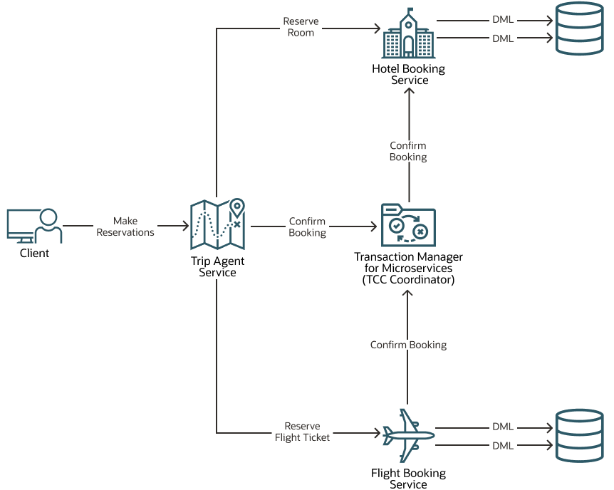

**Table of Contents**

<!-- TOC start (generated with https://github.com/derlin/bitdowntoc) -->

- [About the Travel Agent Application](#about-the-travel-agent-application)
- [Repository Structure for Travel Agent Application Source Code](#repository-structure-for-travel-agent-application-source-code)
- [Configure the MicroTx Client Library Properties](#configure-the-microtx-client-library-properties)

<!-- TOC end -->

# About the Travel Agent Application

The Travel Agent application contains several microservices that interact with each other to complete a transaction. The Trip Agent microservice books a trip, Flight Booking microservice books a flight, and the Hotel Booking microservice books a hotel room. The Trip Agent service accesses both the flight booking and hotel booking services. When a customer books a flight and a hotel, the booking is reserved until either the customer completes the payment and confirms the booking. In case of any failure, the reserved resources are canceled and the resources are returned back to the inventory.

The Travel Agent application uses the Try-Confirm/Cancel (TCC) transaction protocol and MicroTx to coordinate the transactions. The MicroTx libraries are already integrated with the sample application code. Let's use this application to understand how microservices and MicroTx interact with each other in a transaction that uses the TCC transaction protocol.

The following figure shows the various microservices that are available in the Travel Agent application.

*   MicroTx (TCC Coordinator) coordinates the transactions between the various microservices.
*   Trip Agent service is the transaction initiator service, where the TCC transaction starts. It provides APIs to book and cancel a hotel room and a flight ticket. While booking a trip, this service calls the flight booking and hotel booking services. It also sends the confirm or cancel call to the transaction participant services to finalize the transaction.
*   Hotel Booking service participates in the transactions, so it is also called a transaction participant service. It provides APIs to confirm and cancel a hotel room booking.
*   Flight Booking service participates in the transactions, so it is also called a transaction participant service. It provides APIs to confirm and cancel a flight ticket booking.

# Repository Structure for Travel Agent Application Source Code

The Travel Agent Application application demonstrates how you can use integrate MicroTx library files with your application and use an application to participate in transactions that use the TCC transaction protocol. MicroTx client libraries are already incorporated with the Travel Agent application code. You can refer to this application code while integrating the MicroTx libraries with your custom application.

Each sub-folder in this source repository contains the application source code and YAML files that provide the configuration details. Individual folders contain the source files for the microservices in Java and Node.js. Each folder contains the source code for Hotel Booking, Flight Booking, and Trip Agent microservices, YAML file to provide configuration information, and Helm chart to deploy the Travel Agent application.

**Note:** When you run the Travel Agent application, build all the three microservices in either Node.js or Java. Don't try to run the Flight Booking service in Java and the Hotel Booking service in Node.js.

Directory | Description
------------ | -------------
[`java/`](java/) | Java source code and YAML files for the Travel Agent application.
[`nodejs/`](nodejs/) | Node.js source code and YAML files for the Travel Agent application.

# Configure the MicroTx Client Library Properties

Default values are already set for the MicroTx client library properties to make it easier for you to run the Travel Agent application. You can change these values, if required. See the [Transaction Manager for Microservices Developer Guide](https://docs.oracle.com/en/database/oracle/transaction-manager-for-microservices/23.4/tmmdg/set-environment-variables.html#GUID-76E925E2-81D7-45C7-9945-5BDA308A2D73).