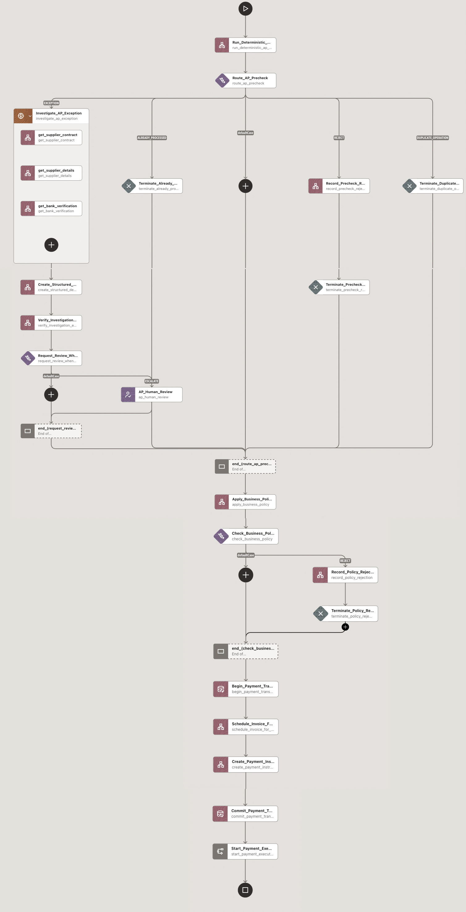
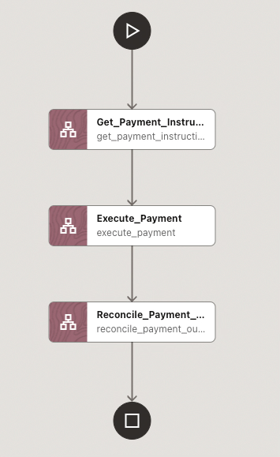
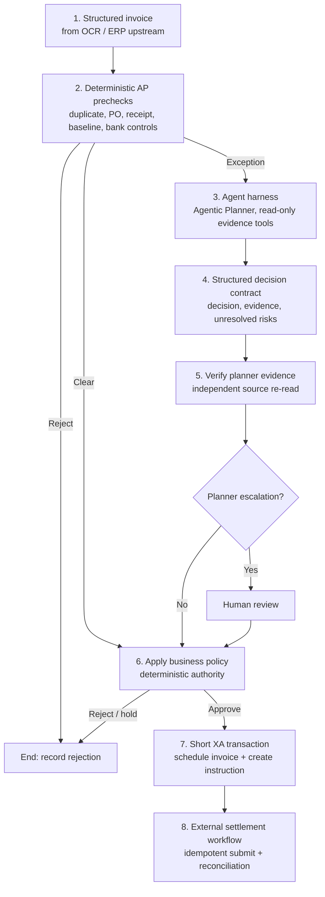

# Accounts payable exception resolution





This sample starts after invoice capture. It accepts a structured invoice, runs AP controls, investigates exceptions with read-only evidence lookups, creates internal payment records in a short XA transaction, and settles the payment after the transaction commits.

## What it does

1. **Precheck**: Checks supplier status, PO, receipt, duplicate history, amount variance, and bank verification.
2. **Route**: Rejects hard failures, sends clear invoices to policy, and sends unresolved exceptions to the planner.
3. **Investigate**: Uses the Agentic Planner to choose from read-only evidence APIs such as contract and bank-verification lookups.
4. **Verify**: Re-reads the evidence cited by the planner and produces a structured decision for policy.
5. **Review**: Creates one Human task only when the planner escalates a case.
6. **Decide**: Applies deterministic AP policy using prechecks, verified evidence, and the Human task result.
7. **Prepare payment**: Schedules the invoice and creates a payment instruction in one short XA transaction.
8. **Settle**: Starts a separate workflow that submits the payment with an idempotency key and reconciles an ambiguous provider response.

## Services

Three runnable services are included. `ap-backend` groups the AP checks, evidence reads, policy, and invoice state used by the sample.

| Service | Port | Responsibility | Planner access |
|---|---:|---|---|
| `ap-backend` | 8083 | Mandatory AP prechecks, planner-visible evidence reads, evidence verification, deterministic policy, invoice/AP state | `GET /evidence/*` only |
| `payment-service` | 8084 | Payment instruction | None |
| `bank-mock` | 8085 | External payment-provider simulation with timeout behavior | None |

## Workflow



The sample accepts every structured invoice. Prechecks decide whether it follows
the straight-through path or enters exception investigation. OCR and correction
are upstream of this sample and are not represented as another workflow.

The planner can call only `ap-backend`'s `GET /evidence/*` routes. It cannot
write AP state, create payment instructions, evaluate policy, or call the bank.
Evidence verification and policy remain deterministic service operations.

## Demo evidence: documents and system records

The workflow begins with a structured invoice; it does not perform OCR or
extract information from a PDF. For a visual demo, distinguish business
documents from the records that operational systems persist:

| Business document | Persistent system record or derived result |
|---|---|
| Supplier invoice | Supplier master and bank-change audit record |
| Purchase order | Bank-verification control record |
| Goods receipt | Invoice history and duplicate-query result |
| Contract excerpt | Payment instruction |
| Supplier bank-change notice | Settlement and reconciliation record |

The source documents explain why a fact exists. The operational records hold
the current state that controls payment. In particular, a duplicate check is a
deterministic query over invoice history, not a PDF stored beside the invoice.

[`demo-documents/README.md`](demo-documents/README.md) defines the visual
document pack; [`demo-data/`](demo-data) contains structured examples of the
system-of-record data for the headline and timeout cases. The running mock
`ap-backend` and `payment-service` persist these records in Oracle Database
and enlist their write endpoints as MicroTx XA participants. `bank-mock`
remains non-transactional: it represents the external payment rail, where
idempotency and reconciliation—not XA—are the safe controls.

## Files

```text
accounts-payable-exception-resolution/
├── README.md
├── docker-compose.yml
├── run-local.sh
├── prompts/
│   └── ap-exception-planner.md
├── demo-documents/
│   └── README.md                  # visual-document manifest
├── demo-data/                     # system-of-record fixture model
│   ├── bank-verifications/
│   ├── invoice-history.json
│   ├── payment-instructions/
│   ├── settlements/
│   ├── supplier-bank-changes/
│   └── supplier-master/
├── services/
│   ├── ap-backend/
│   ├── payment-service/
│   └── bank-mock/
├── test-data/
│   ├── 01-clean.json
│   ├── 02-freight-variance.json
│   ├── 03-bank-change.json
│   ├── 04-duplicate.json
│   ├── 05-partial-receipt.json
│   ├── 06-payment-timeout.json
│   └── EXPECTED.md
├── tests/
│   ├── test_harness_boundary.py
│   └── test_replay_cases.py
└── workflows/
    ├── ap-exception-resolution-workflow.json
    ├── ap-payment-preparation-xa-rollback-workflow.json
    └── ap-payment-settlement-workflow.json
```

## Workflow definitions

`workflows/ap-exception-resolution-workflow.json` is version **11**. Use this
version for new runs. A repeated `operationId` returns the existing result;
using a new operation ID for an invoice already scheduled for payment is
rejected.

The XA transaction timeout is five minutes (`300000` milliseconds), which gives
both Oracle participants time to enlist.

1. `Run_Deterministic_AP_Prechecks` - duplicate, PO, receipt, and baseline-match checks
2. `Route_AP_Precheck` - `REJECT` ends; `CLEAR` bypasses investigation; only `EXCEPTION` enters the agent harness
3. `Investigate_AP_Exception` - `AGENTIC_PLANNER`, only for an unresolved exception
4. `Create_Structured_Decision_Contract` - extracts the final decision from the Agentic Planner's durable `plannerHistory` output
5. `Verify_Investigation_Evidence` - independently re-reads planner-cited facts
6. `AP_Human_Review` - only when the investigation escalates
7. `Apply_Business_Policy` - the single deterministic business-authority step for every non-rejected invoice
8. `Check_Business_Policy` - rejects, holds for review, or continues to payment preparation
9. `Begin_Payment_Transaction` - XA BEGIN
10. `Schedule_Invoice_For_Payment` - AP write
11. `Create_Payment_Instruction` - payment write
12. `Commit_Payment_Transaction` - XA COMMIT
13. `Start_Payment_Settlement` - asynchronously starts the linked payment-settlement workflow

Clear invoices skip the investigation tasks but still pass business policy. The
settlement workflow starts only after COMMIT. `Start_Payment_Settlement` is
optional so that a dispatch error after COMMIT does not start the XA rollback
workflow. A production implementation would recover that dispatch from an
outbox or event written with the payment-preparation state.

## Workflow 2: external payment settlement and reconciliation

`workflows/ap-payment-settlement-workflow.json` runs after payment preparation
commits.

It:

1. reads the committed payment instruction by `operationId`;
2. calls `bank-mock` with the same `Idempotency-Key`;
3. allows the payment-settlement POST to time out;
4. always reconciles using `GET /settlements/{operationId}`.

If a provider POST times out, the workflow reconciles by `operationId` instead
of creating another payment.

### Why external payment settlement uses reconciliation, not LRA

MicroTx supports longer-running compensation patterns such as LRA. They are not
used for bank settlement here: once a bank accepts a payment, a local
compensating action cannot be assumed to reverse it. This workflow uses a stable
`operationId`, idempotent submission, and reconciliation instead. LRA is better
suited to a compensatable action such as releasing a reservation.

## Planner contract

The prompt in `prompts/ap-exception-planner.md` follows the MicroTx Agentic Planner protocol: planner responses contain `status` and `next_tools_to_call`. On the final `SUCCESS` response the sample also asks for a business `decision`:

```json
{
  "status": "SUCCESS",
  "next_tools_to_call": [],
  "decision": "ESCALATE",
  "evidence": [
    {"type":"contract","reference":"C-2291 s7.2","finding":"FREIGHT_WITHIN_ALLOWANCE"},
    {"type":"bank_verification","reference":"SUP-NORTHSTAR","finding":"PENDING"}
  ],
  "unresolvedRisks": ["supplier_bank_change_unverified"],
  "reason": "The $800 variance is within the contract freight allowance. The new bank account is still awaiting independent verification."
}
```

The business decision is one of `APPROVE`, `ESCALATE`, or `REJECT`. It is **not** payment authority.

## Local setup and test

Run the static Agent Harness boundary check before importing any workflow. It
needs no database, model, or running services:

```bash
python3 tests/test_harness_boundary.py
```

The HTTP replay tests are optional API-contract checks after the services have
been started with `./run-local.sh`; they do not substitute for a real TCS XA
test. The recommended end-to-end validation is the two-case workflow demo
below, followed by TCS branch inspection and the injected rollback case.

### Run the services as local processes, without Docker

If the MicroTx Workflows server is running directly on your machine, start the
two Spring Boot XA participants and the Python bank mock with one command.
First create the AP schema from `services/ap-backend/database/schema.sql` and
load `services/ap-backend/database/demo-data.sql`. Create the payment schema
from `services/payment-service/database/schema.sql`.

The schema and demo seed scripts are intentionally a one-time operator action;
`run-local.sh` never creates, seeds, or clears database tables. That keeps the
service startup production-like and prevents an application restart from
overwriting system-of-record data.

The schemas may be on one Oracle Database instance, but use separate schemas
or databases and distinct XA resource-manager IDs. Export the settings below
(`.env.example` is a copyable template):

```bash
export AP_DATABASE_URL='jdbc:oracle:thin:@//db-host:1521/service_name'
export AP_DATABASE_USERNAME='AP_BACKEND'
export AP_DATABASE_PASSWORD='...'
export PAYMENT_DATABASE_URL='jdbc:oracle:thin:@//db-host:1521/service_name'
export PAYMENT_DATABASE_USERNAME='PAYMENT_SERVICE'
export PAYMENT_DATABASE_PASSWORD='...'
export MICROTX_COORDINATOR_URL='http://127.0.0.1:9000/api/v1'
export AP_MICROTX_XA_RESOURCE_MANAGER_ID='5BFC0C43-5207-4B1F-8D16-A0B7A6B5A803'
export PAYMENT_MICROTX_XA_RESOURCE_MANAGER_ID='65A79F32-E6A6-4AFE-89B6-45F0E70C7418'
export AP_DATABASE_CONNECT_TIMEOUT_SECONDS=10
export PAYMENT_DATABASE_CONNECT_TIMEOUT_SECONDS=10
```

These are normal Spring properties too, for example
`--ap.datasource.url=...`; environment variables avoid putting credentials in
shell history. The MicroTx Java distribution must have installed
`com.oracle.microtx:microtx-spring-boot-starter:1.0-SNAPSHOT` in Maven, as it
does for the existing XA Java samples.

Both Java services validate `SELECT 1 FROM DUAL` during startup. A bad database
URL, wallet, password, service name, firewall rule, or schema now stops the
runner with the Oracle error instead of later timing out on `/prechecks`.

```bash
./run-local.sh
```

On its first run, the script creates `.venv` for `bank-mock` and builds the
two Spring Boot jars. It then starts the three services on `127.0.0.1:8083`
through `127.0.0.1:8085`. Later runs leave already-running services alone.
Logs are in `.local-run/`.

For a local Workflow server, import workflow definitions whose HTTP task URIs
use these local addresses instead of Docker service names:

```text
http://ap-backend:8083       -> http://127.0.0.1:8083
http://payment-service:8084 -> http://127.0.0.1:8084
http://bank-mock:8085       -> http://127.0.0.1:8085
http://otmm-tcs:9000        -> the URL of your locally running TCS
```

Use the Workflow Builder to make those endpoint substitutions while importing,
or maintain local copies of the definitions outside the repository. Stop the
services when finished:

```bash
./run-local.sh stop
```

`ap-backend` and `payment-service` are MicroTx Spring XA participants. Their
write endpoints receive the transaction context from Workflows and use the
MicroTx-managed `microTxSqlConnection`, which enlists the two Oracle branches.
`bank-mock` deliberately does not enlist.

In Workflow Builder, select **Enlist in transaction** for both
`Schedule_Invoice_For_Payment` and `Create_Payment_Instruction`. The checked-in
workflow sets `enlistInTxn: true`; without it, an HTTP write is outside XA even
when it appears between `BEGIN` and `COMMIT` tasks.

The `BEGIN` task's `transactionTimeout` is measured in **milliseconds**. Keep it
at `300000` (five minutes); `300` expires before a remote Oracle participant can
enlist and makes the coordinator roll the transaction back.

### Repeat a demo safely

| Rerun type | Result | Cleanup needed? |
|---|---|---|
| Same invoice and same `operationId` after a committed run | Ends as `OPERATION_ALREADY_PROCESSED`; no second XA transaction, instruction, or settlement | No |
| Same invoice with a new `operationId` | Ends as `INVOICE_ALREADY_SCHEDULED`, preserving the original payment state | No |
| Run every scenario again from its initial state | Reset mutable AP/payment demo state, then restart `bank-mock` | Yes |

For a clean repeatable demo, run the following as their respective schema
owners, then restart the local services to clear `bank-mock`'s in-memory
settlements:

```text
services/ap-backend/database/reset-demo-state.sql
services/payment-service/database/reset-demo-state.sql
./run-local.sh stop
./run-local.sh
```

The reset scripts retain reference evidence and the intentionally seeded paid
invoice history used by the duplicate test. They delete only AP operation state
and payment instructions created by workflow executions. Never use them in a
production schema.

### What the local tests prove

The local replay test does **not** claim to be an end-to-end MicroTx/LLM test. `scripted_planner()` makes the same class of read-only calls and emits the same decision contract deterministically so CI remains fast and reproducible.

`tests/test_harness_boundary.py` is different: it reads the real workflow JSON and fails if a planner task:

- uses anything other than GET;
- targets anything other than `ap-backend`;
- points at a write-like path;
- gains access to a non-evidence path or to payment/settlement services;
- or if the financial transaction is placed before policy evaluation.

Keep this test in CI. It verifies the sample's central authority claim as configuration, not as a prompt instruction.

## Run with MicroTx Workflows

The exact deployment commands depend on how your MicroTx Workflows environment is installed. The steps below are the sample-level configuration required after MicroTx Workflows is available.

### 1. Make the sample services reachable from Workflows

Run the included Docker stack for local development, or deploy the three services to the network/namespace from which the MicroTx Workflows runtime can resolve:

```text
ap-backend:8083
payment-service:8084
bank-mock:8085
```

The workflow definitions use those service names. Change the URIs if your environment uses different DNS names.

### 2. Configure an LLM profile

In MicroTx Workflows, create an LLM profile named:

```text
ap-planner-llm
```

Choose the provider/model available in your environment. The workflow JSON deliberately uses `<configure-in-MicroTx>` as the model placeholder so the public sample does not assume one provider.

### 3. Create the Agentic Planner prompt template

Create a prompt template named:

```text
ap_exception_planner
```

Use the contents of:

```text
prompts/ap-exception-planner.md
```

The planner task references this template by name.

### 4. Import the workflows

Import these definitions into MicroTx Workflows:

```text
workflows/ap-payment-preparation-xa-rollback-workflow.json
workflows/ap-payment-settlement-workflow.json
workflows/ap-exception-resolution-workflow.json
```

Import the two referenced workflows first, then import
`ap_exception_resolution` version 11. Existing executions and the old workflow
names are not changed by this import; use version 11 for all new runs.

**Pre-merge validation:** import and export these definitions once through the Workflow Builder used for the target MicroTx release. This repository version is aligned to the current documented 26.1 task shape, but generated/default properties can vary by release and should be normalized by the Builder before the sample is merged.

### 5. Start the AP exception workflow

Use a test payload such as `test-data/03-bank-change.json`. Only `operationId` and `invoice` are workflow inputs; `_description` in the test-data file is documentation and should be removed before submitting the input.

Example workflow input:

```json
{
  "operationId": "OP-2026-0003",
  "invoice": {
    "invoiceId": "INV-1048",
    "invoiceNumber": "INV-1048",
    "supplierId": "SUP-NORTHSTAR",
    "poId": "PO-7812",
    "amount": 48700.0,
    "currency": "USD",
    "invoiceDate": "2026-08-21",
    "simulateSettlementTimeout": false
  }
}
```

For the bank-change case, the planner should gather enough evidence to return `ESCALATE`. Complete the `AP_Human_Review` Human task in the Workflows UI with output similar to:

```json
{
  "approved": true,
  "reviewer": "ap.reviewer@example.com",
  "note": "Confirmed new account by callback to known supplier contact"
}
```

The human result is then passed to the deterministic policy endpoint in `ap-backend`. The policy rules still execute; the review does not bypass them.

### 6. Follow external payment settlement after the main workflow commits

After `ap_exception_resolution` commits, `Start_Payment_Settlement` starts `ap_payment_settlement` asynchronously with the same `operationId` as its correlation ID. Use the workflow execution view to navigate from the start task to the payment-settlement run.

For a timeout demonstration, start `ap_payment_settlement` directly only when you are running the child workflow in isolation:

```json
{
  "operationId": "OP-2026-0003",
  "simulateSettlementTimeout": false
}
```

For the timeout case use:

```json
{
  "operationId": "OP-2026-0006",
  "simulateSettlementTimeout": true
}
```

The payment-provider POST may time out after `bank-mock` has persisted the operation. `Reconcile_Payment_Outcome` must still return `SETTLED` for the same `operationId`.

## XA boundary and proof

The main workflow's five-minute short XA boundary contains exactly two writes:
the AP invoice scheduling update at port 8083 and payment-instruction creation
at port 8084. Both are Java Spring Boot MicroTx participants with Oracle XA
data sources and separate resource-manager IDs. Bank submission starts only
after COMMIT and is outside XA.

To prove atomicity, configure the payment HTTP task with
`?simulateFailure=true`. It returns 500 after the AP branch writes; TCS must
roll back both branches. The invoice must remain `RECEIVED` and
`GET /payment-instructions/{operationId}` must return 404. A successful run
should list two branches in TCS transaction details.

## Test cases

The cases are deliberately small and each has one reason to exist.

### Recommended two-case demo

Use `03-bank-change.json` for both demonstrations. It is the only headline
case that visibly exercises every stage: prechecks, planner evidence tools,
structured decision contract, evidence verification, the one Human task,
business policy, short XA preparation, and external payment settlement.

| Demo | Input | Human-task action | Expected result |
|---|---|---|---|
| Positive | `03-bank-change.json` | Mark `AP_Human_Review` as `COMPLETED` | Policy approves; the workflow reaches XA and the child payment-settlement workflow reconciles `SETTLED`. |
| Negative | Same `03-bank-change.json` with a new `operationId` | Mark `AP_Human_Review` as Rejected or Failed | Policy records the rejection; no XA transaction, payment instruction, or settlement is created. |

In the current Human-task UI, task status is authoritative: `COMPLETED`
approves; Rejected or Failed rejects. The task is marked optional solely so a
rejected review reaches business policy, records its rejection, and ends in the
normal policy-rejected terminal branch. A future review form can additionally
supply an explicit `approved` field.

The remaining fixtures are retained for QA and customer exploration.

| Case | Planner | Policy | Expected outcome |
|---|---|---|---|
| `01-clean` | not run | APPROVE | payment prepared / external settlement succeeds |
| `02-freight-variance` | APPROVE | APPROVE | contract explains variance |
| `03-bank-change` | ESCALATE | APPROVE after human review | payment prepared |
| `04-duplicate` | not run | REJECT | no payment |
| `05-partial-receipt` | ESCALATE | REJECT | hard policy control wins even after review |
| `06-payment-timeout` | not run | APPROVE | reconciliation finds one settled operation |

Exact deterministic expectations are in `test-data/EXPECTED.md`.

