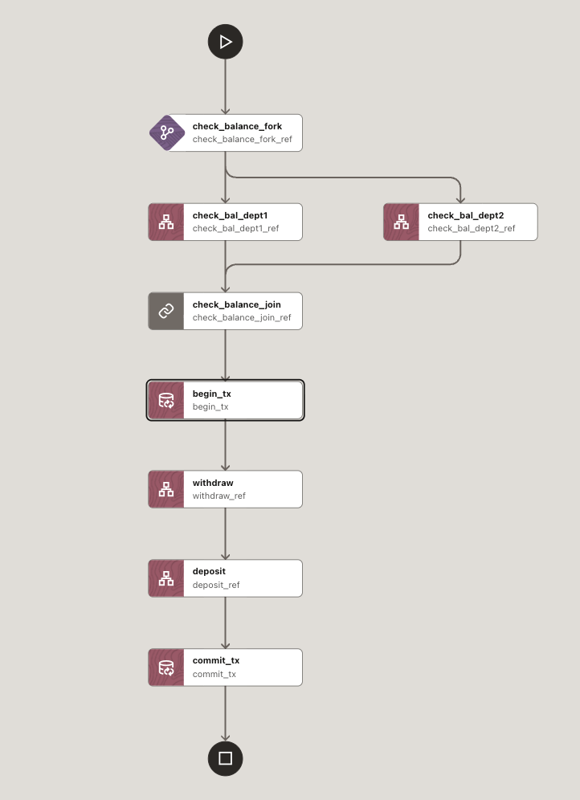
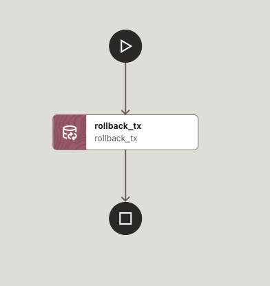

# Financial workflows — Payment processing using XA transactions


_Figure 1: XA transaction workflow_


_Figure 2: Rollback failure workflow_

## Business problem
Payment flows often span multiple independent systems. For example, debit a user's internal account balance and charge an external payment gateway. These operations must be atomic: either both succeed, or both fail. Otherwise, you risk inconsistent states (e.g., user is debited but payment is not processed).

## What's in this folder
- `xa-transaction-wf.json` — Main XA workflow definition (`transaction_xa`)
- `xa-failure-wf.json` — Failure/rollback workflow (`rollback_txn`)

## How it works (high level)
1. Check balances in parallel
   - Two HTTP GET calls fetch account details for `from` and `to` departments/services.
   - Services are expected at:
     - `http://host.docker.internal:8081/accounts/${workflow.input.from}`
     - `http://host.docker.internal:8082/accounts/${workflow.input.to}`
2. Begin XA transaction
   - TRANSACTION task calls the coordinator with:
     - `coordinatorUrl: http://host.docker.internal:9000/api/v1`
     - `transactionType: XA`
     - `action: BEGIN`
3. Perform operations within the transaction
   - Withdraw from `from` account:
     - `POST http://host.docker.internal:8081/accounts/${workflow.input.from}/withdraw?amount=${workflow.input.amount}`
   - Deposit to `to` account:
     - `POST http://host.docker.internal:8082/accounts/${workflow.input.to}/deposit?amount=${workflow.input.amount}`
4. Commit XA transaction
   - TRANSACTION task with `action: COMMIT`

If any step fails, the workflow's `failureWorkflow` is invoked:
- `xa-failure-wf.json` (`rollback_txn`): a single TRANSACTION task with `action: ROLLBACK` to revert the XA transaction.

## Inputs
The main workflow `transaction_xa` expects:
- `from` — source account identifier
- `to` — destination account identifier
- `amount` — transfer amount (numeric)

Example start payload (conceptual):
```json
{
  "from": "acct-1001",
  "to": "acct-2002",
  "amount": 50
}
```

## Expected behavior
- On success: both debit and credit occur, then the transaction is committed.
- On failure: the failure workflow rolls back the transaction to maintain consistency.

## Prerequisites
- XA Transaction Coordinator reachable at `http://host.docker.internal:9000/api/v1`
- Account services running at ports `8081` and `8082` with the expected APIs
- The two workflow definitions registered in your workflow engine

## Files reference
- `xa-transaction-wf.json`: Defines the primary flow including:
  - Parallel balance checks (FORK/JOIN)
  - XA `BEGIN` / `COMMIT` TRANSACTION tasks
  - HTTP `withdraw` and `deposit` calls
  - `failureWorkflow: "rollback_txn"`
- `xa-failure-wf.json`: Defines `rollback_txn`, which issues a `ROLLBACK` TRANSACTION action
