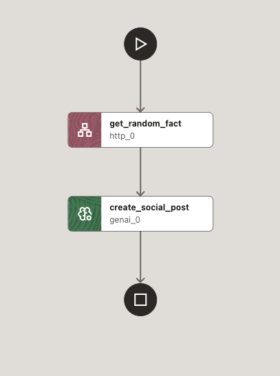

# Getting started — Fun Fact post generator


_Figure 1: Fun Fact to Social Post workflow_

## What this sample is
A minimal workflow that fetches a random fact from a public API and then uses a GenAI task to turn that fact into an engaging social media post with hashtags.

- Public API used: https://uselessfacts.jsph.pl/api/v2/facts/random
- File in this folder:
  - [sample-workflow.json](./sample-workflow.json) — Workflow definition (`Fact_to_Social_Post`)

## How it works
1. Fetch a fact (HTTP task)
   - GET https://uselessfacts.jsph.pl/api/v2/facts/random
   - Accepts JSON and returns a random fact.
2. Generate a social post (GenAI task)
   - Passes the fetched fact as input to an LLM with a one-shot prompt.
   - The model rewrites the fact into a catchy social media post and appends a few relevant hashtags.

## Inputs and outputs
- Inputs: none (the workflow does not require any start parameters)
- Outputs (from `sample-workflow.json`):
  - `original_fact` — the raw fact returned by the HTTP task
  - `social_media_post` — the GenAI-generated post text

Example start payload:
```json
{}
```

## Expected behavior
- On success:
  - The HTTP task retrieves a random fact.
  - The GenAI task returns a short, engaging post that references the fact and includes 2-3 hashtags.
- On failure:
  - Check connectivity to the public API and verify your LLM configuration.

## Prerequisites
- Internet access to call the public API.
- A configured LLM profile referenced by the workflow (`llmProfile`, e.g., `oci_models` with `model: openai.gpt-4.1`) or adjust these fields to match your GenAI provider.

## Notes
- This sample demonstrates simple task chaining: the HTTP task output is used directly as input to the GenAI task prompt.
- You can modify the prompt to change the tone, length, or style of the generated post.
