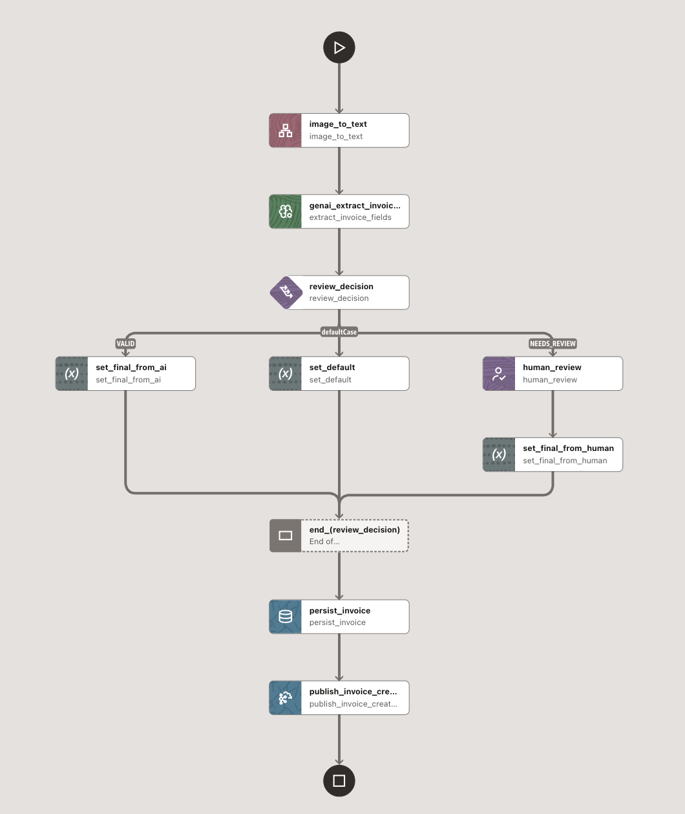

# Invoice processing (OCR + GenAI + Human review)



This sample turns an invoice image into structured fields, optionally routes to a human for validation, then stores the result and publishes an event.

## What it does

1. **OCR**: Calls OCR.space on the invoice image URL.
2. **Extract**: Uses a GenAI task to extract invoice fields and return strict JSON.
3. **Decide**: If extraction is incomplete → **HUMAN** review; else continue.
4. **Persist**: Inserts the final invoice into `INVOICES`.
5. **Notify**: Publishes an EventQ message with the `invoiceId`.

## Files

- [invoice_processing_workflow.json](./invoice_processing_workflow.json)

## Start payloads

Normal path (AI returns `VALID`):

```json
{
  "invoiceId": "1",
  "url": "https://objectstorage.us-ashburn-1.oraclecloud.com/n/oabcs1/b/microtx-conductor/o/sampleinvoice.png",
  "sourceSystem": "ONLINE"
}
```

Human-in-the-loop path (AI returns `NEEDS_REVIEW`):

```json
{
  "invoiceId": "2",
  "url": "https://objectstorage.us-ashburn-1.oraclecloud.com/n/oabcs1/b/microtx-conductor/o/sampleinvoice-2.png",
  "sourceSystem": "ONLINE"
}
```

## Notes / prerequisites

- OCR uses an OCR.space test key (`apikey: helloworld`). If you hit rate limits, generate your own API key at https://ocr.space/.
- Configure the referenced profiles/connectors:
  - GenAI: `genai-invoice-profile` (LLM profile `oci_models`)
  - DB: `oracle-db-profile` and table `INVOICES`
  - EventQ topic: `INVOICE_EVENT_Q`

## Create the EventQ topic

Run on the target database (once):

```sql
BEGIN
  DBMS_AQADM.CREATE_TRANSACTIONAL_EVENT_QUEUE(
    queue_name         => 'INVOICE_EVENT_Q',
    multiple_consumers => TRUE
  );
END;
/

BEGIN
  DBMS_AQADM.START_QUEUE(
    queue_name => 'INVOICE_EVENT_Q'
  );
END;
/
```

## Create the `INVOICES` table

```sql
CREATE TABLE INVOICES (
    invoice_id      VARCHAR2(100),
    biller          VARCHAR2(255),
    address         VARCHAR2(500),
    amount_due      NUMBER(12,2),
    currency        VARCHAR2(10),
    due_date        VARCHAR2(20),
    source_file     VARCHAR2(1000),
    created_at      TIMESTAMP DEFAULT CURRENT_TIMESTAMP
);
```