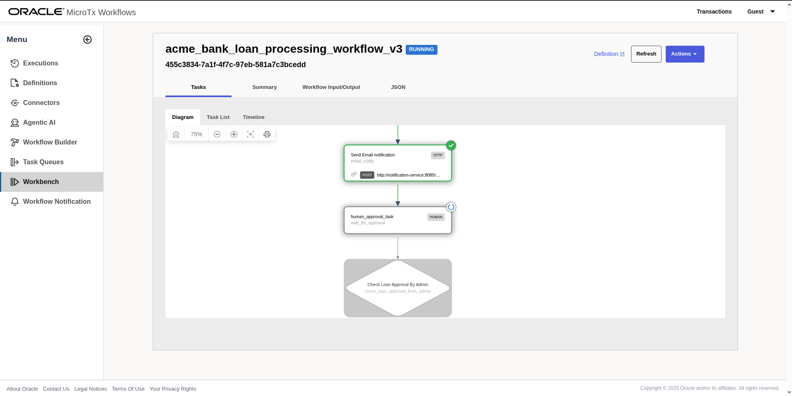
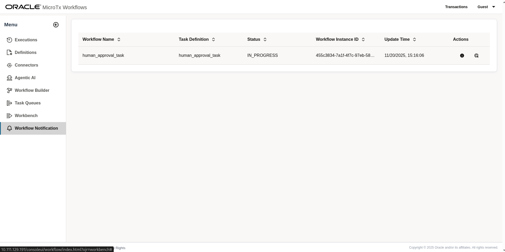
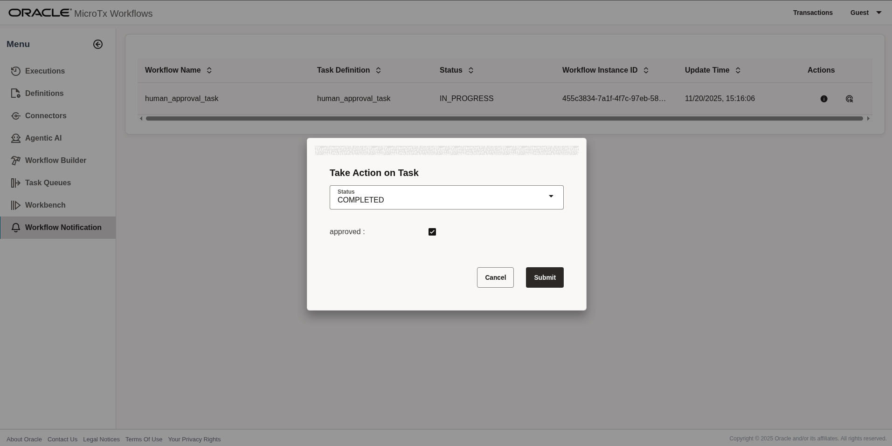
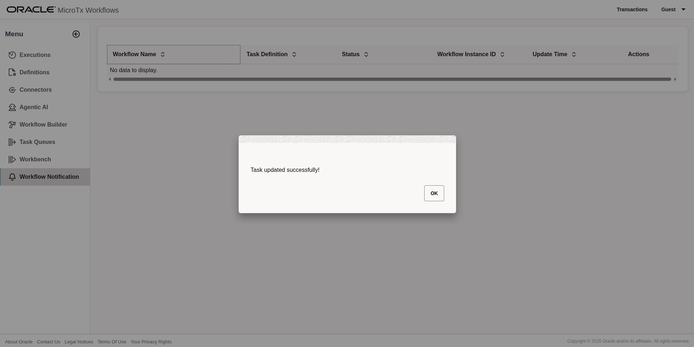
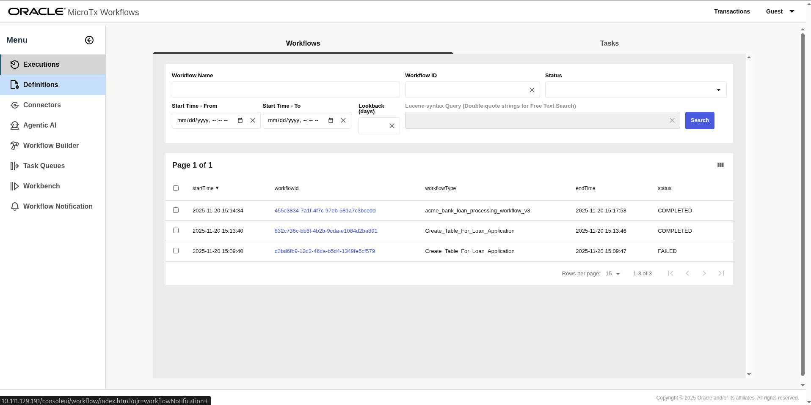
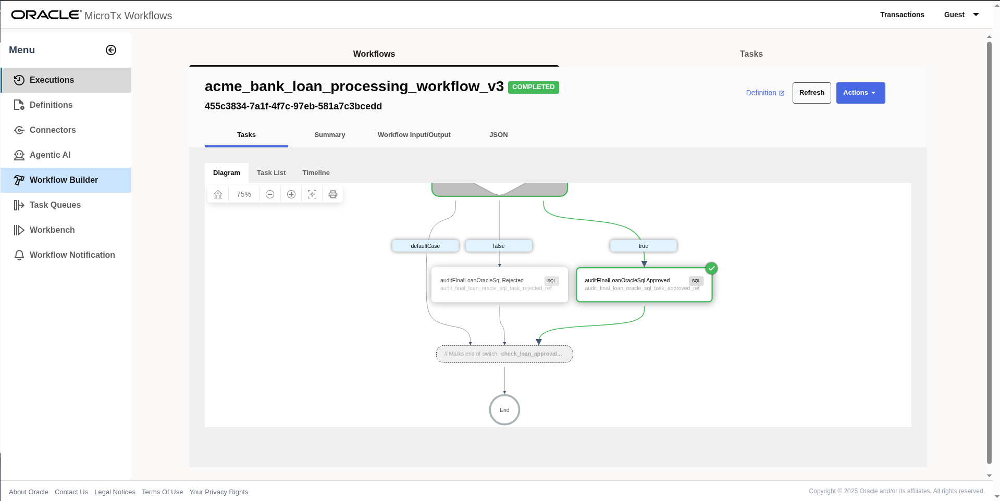
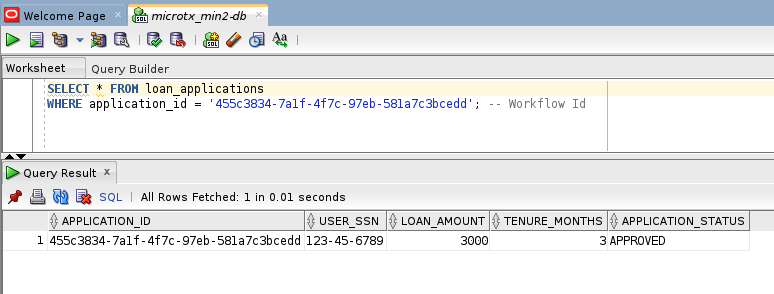

# Loan Application Processing – Sample Agentic Workflow

This repository contains a sample loan application processing workflow. The example demonstrates how to combine LLMs, agentic tasks, external services, human steps, and MCP tools into an intelligent, resilient, and observable workflow.

Traditional rule-based workflows often struggle with real-time decisions, unstructured inputs, and distributed system orchestration. This sample shows how agentic workflows can address those challenges by integrating LLM-powered extraction, reusable agents, verification tools, and adaptive planning.

## What This Sample Demonstrates

This example walks through a realistic end-to-end loan application lifecycle and illustrates how to:

- Build scalable, no-code workflows using MicroTx's visual or JSON-based modeling
- Integrate LLMs, REST services, GenAI tasks, Agentic tasks, and the Agentic Planner
- Use human-in-the-loop steps
- Connect to external tools using the Model Context Protocol (MCP)

## Workflow Overview

The sample workflow executes the following major steps:

### 1. Submission & Data Extraction
A user submits a loan application. A GenAI task extracts structured fields from natural-language input (e.g., income, employer, ID numbers).

### 2. Completeness Check
The workflow validates whether all required fields are present. If information is missing, the workflow notifies the applicant and terminates.

### 3. Loan Application Record Creation
Once complete, the workflow creates a new loan application record in the database.

### 4. Orchestration via Agentic Planner
The Agentic Planner evaluates context and triggers the next required actions, such as:
- Verifying documents and validating applicant identity using tools (e.g., OCR or MCP-based tools)
- Eligibility/Credit score evaluation
- Anti-money-laundering (AML) checks
- If human review is required, the workflow assigns an approval task and waits for a response

### 5. Iterative Agentic Processing
The planner uses a plan → reflect → replan loop to continue executing required steps until all verification and compliance tasks are complete.

### 6. Final Decision
Based on all validations:

**Approval:**
- A manual final signoff is requested
- On confirmation, the application status is updated to Approved

**Rejection:**
- The workflow notifies the applicant
- The workflow ends with a Rejected status


## Configure LLM Connector

---
1. Open MicroTx console on browser and navigate to Workflows


---
2. Select connectors from left pane


---
3. Edit the predefined OCI-based LLM profile named `llm-oci` in the Connectors section and update the default parameters.


**Parameters required to configure:**

a. OCI `User ID`

example : `ocid1.user.oc1..aaaaaaaagqle2`

b. OCI `Tenancy ID`

example : `ocid1.user.oc1..aaaaaaaagqle2`

c. OCI `Region`

example: `us-chicago-1`

d. OCI `Fingerprint`:

example: `8f:06:3d:b1:..............:fe:e0:44:c1:dd:9c:16`

e. OCI User `Pass Phrase`

f. OCI `Compartment ID`

example : `ocid1.compartment.oc1..aaaaaaaa..`

g. OCI User `API Key`
   User's private API key file content.

**Reference:** [OCI API Signing Key Documentation](https://docs.oracle.com/en-us/iaas/Content/Identity/access/to_upload_an_API_signing_key.htm)

After updating the OCI LLM configurations, save the profile.

---
4. Click on the `Database` tab under the `Connectors` menu.


---
5. Edit the database profile `oracle-database` and update the Oracle database connection details that store the loan application data.


---
6. From the menu, select `Definitions` and edit the `Create_Table_For_Loan_Application` workflow.


---
7. Select the task and verify the SQL CREATE TABLE command. This command works with Oracle Database 23ai and above. If you are using an older version of Oracle Database, modify the CREATE TABLE command as needed (remove `IF EXISTS`).


---
8. From the menu, select `Definitions` and view the `acme_bank_loan_processing_workflow_v3` workflow, which visualizes the complete loan approval workflow.


---
9. From the menu, select `Workbench`.


---
10. From the `Workbench` menu, select the `Create_Table_For_Loan_Application` workflow and execute it. A workflow run link will appear on the right side in the `Execution History` - click on that link.


---
11. View the execution of the `Create_Table_For_Loan_Application` workflow.


---
12. Monitor the workflow execution progress.


---
13. From `Workbench` menu, select `acme_bank_loan_processing_workflow_v3` workflow.


---
14. Provide below JSON payload and click `Execute Workflow`.
   A workflow run link appears on right side `Execution History`, click on that

```json
{
  "loan_application_text": "I am looking for the $3000 loan for 3 years tenure. Provide me best interest rate and terms. My ssn number is 123-45-6789",
  "document": "https://raw.githubusercontent.com/oracle-samples/microtx-samples/2fc203578ddd544af796aaf0bf270ae3978b78e7/workflow/loan-application/ocr-microservice/samples_for_ocr/driving-license.png"
}
```


---
15. View the execution of `acme_bank_loan_processing_workflow_v3` workflow


---
16. Once Workflow Execution reaches the `Human_approval_task`, workflow expects user to act on notification, which is used to approve or reject the loan.



---
17. To view the notification, from `Menu` click on `Workflow Notification`



---
18. Click on `Actions` from notification `human_approcal_task`


---
19. Click on notification and either `Approve` or `Reject`





---
20. From `Menu`, click on `Executions`, click on the workflow `acme_bank_loan_processing_workflow_v3` execution link with recent workflow id and see the workflow status.



Select workflow



---
21.User can login to the database and verify the Loan application status from the table using below query.

```sql
SELECT * FROM LOAN_APPLICATIONS WHERE ID ='workflow-execution-id';
```


