## Running Loan Approval Workflow

### Configure LLM Connector

---
1. Open MicroTx console on browser and navigate to Workflows

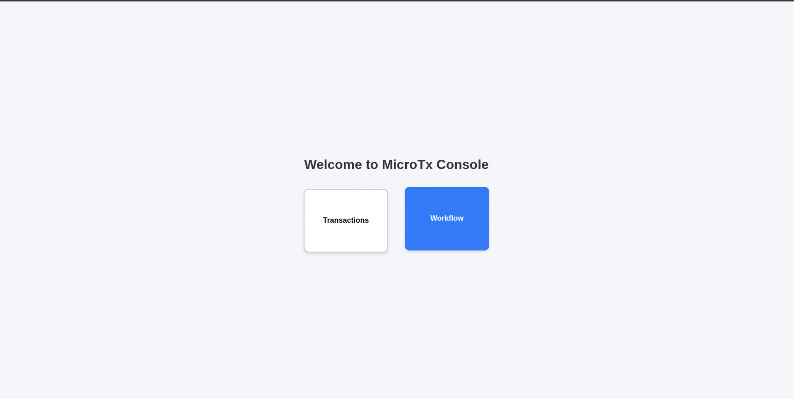

---
2. Select connectors from left pane
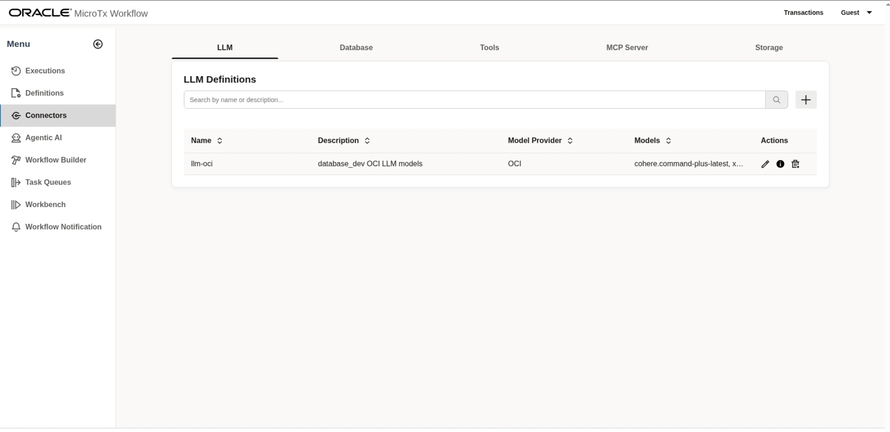

---
3. Edit predefined `OCI` based `LLM` profile from `Connectors` called `llm-oci` and change the default parameters.
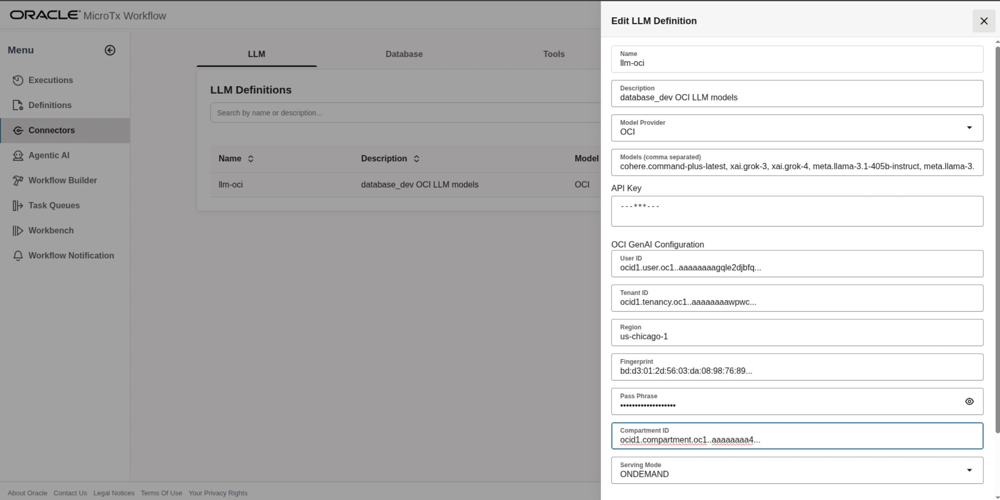

**Parameters required to configure:**

a. OCI `User ID` 

example : `ocid1.user.oc1..aaaaaaaagqle2`

b. OCI `Tenancy ID`

example : `ocid1.user.oc1..aaaaaaaagqle2`

c. OCI `Region` 

example: `us-chicago-1`

d. OCI `Fingerprint`: 

example: `8f:06:3d:b1:..............:fe:e0:44:c1:dd:9c:16`

e. OCI User `Pass Phrase`

f. OCI `Compartment ID` 

example : `ocid1.compartment.oc1..aaaaaaaa..`

g. OCI User `API Key` 
   User's private API key file content.

After updating the OCI LLM configurations, ***Save*** profile 

---
4. Click on `Database` tab under `Connectors` menu

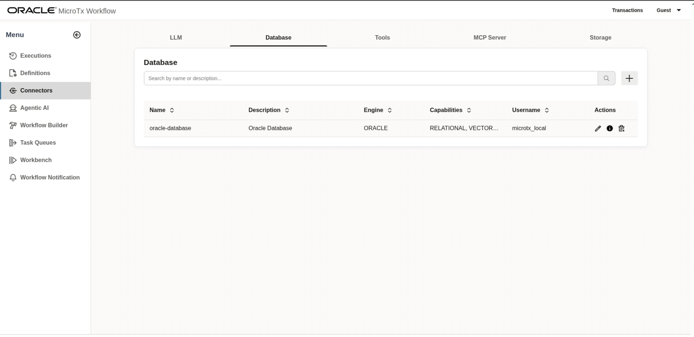

---
5. Edit database profile `oracle-database` and update the oracle database details which stores the loan application data

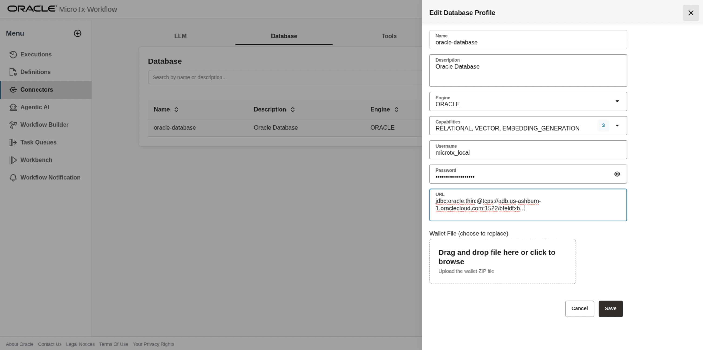

---
6. From menu select `Definitions` and edit the `Create_Table_For_Loan_Application` workflow

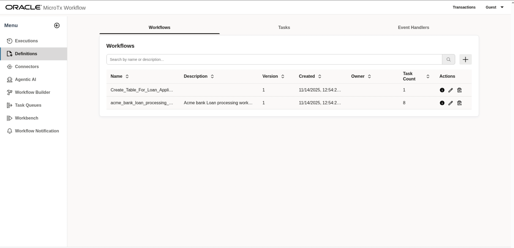

---
7. Select the task and verify the SQL create table command, it works in 23ai datbase and above. If you are using an older version of an oracle database, modify the create table command as needed (remove `IF EXISTS`).

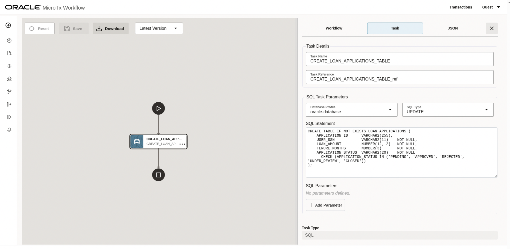

---
8. From menu select `Definitions` and view the `acme_bank_loan_processing_workflow_v3` workflow, which visualizes complete loan approval workflow

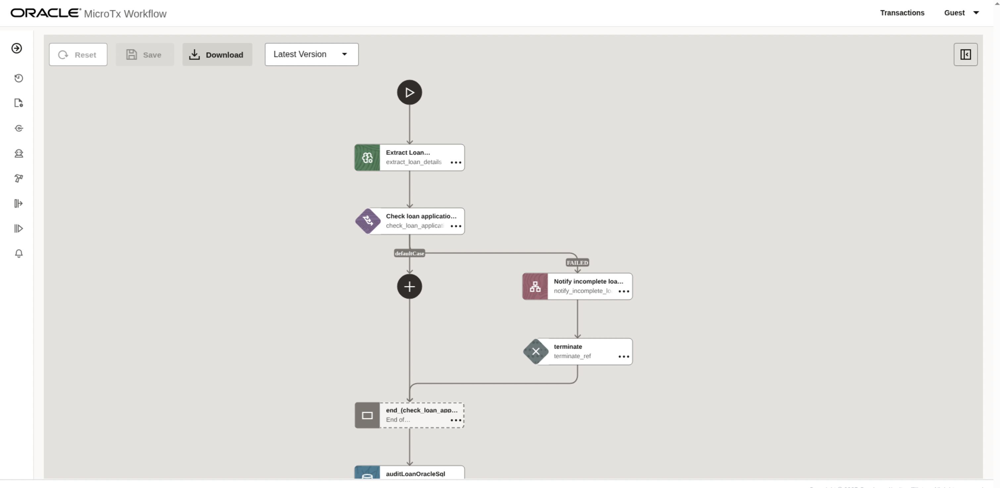

---
9. From menu select `Workbench`

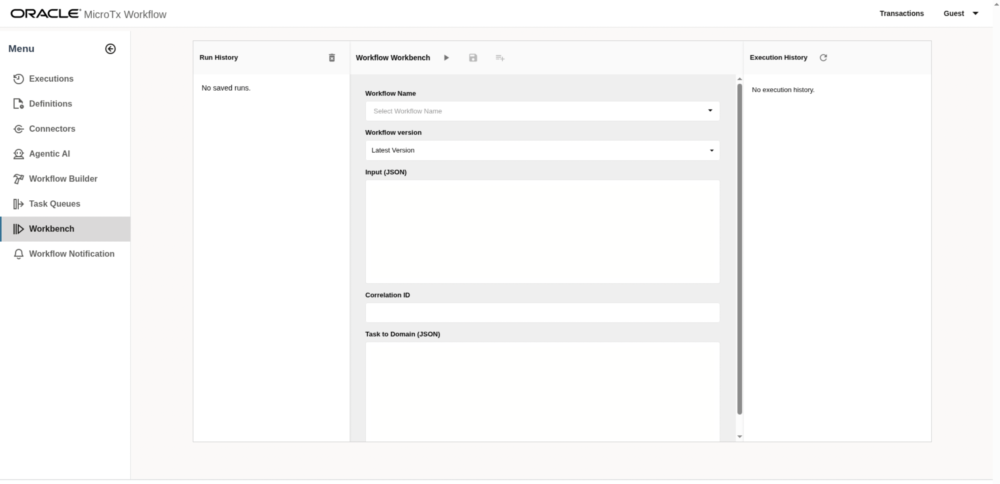

---
10. From `Workbench` menu, select `Create_Table_For_Loan_Application` workflow and execute.
    And a workflow run link appears on right side `Execution History`, click on that  

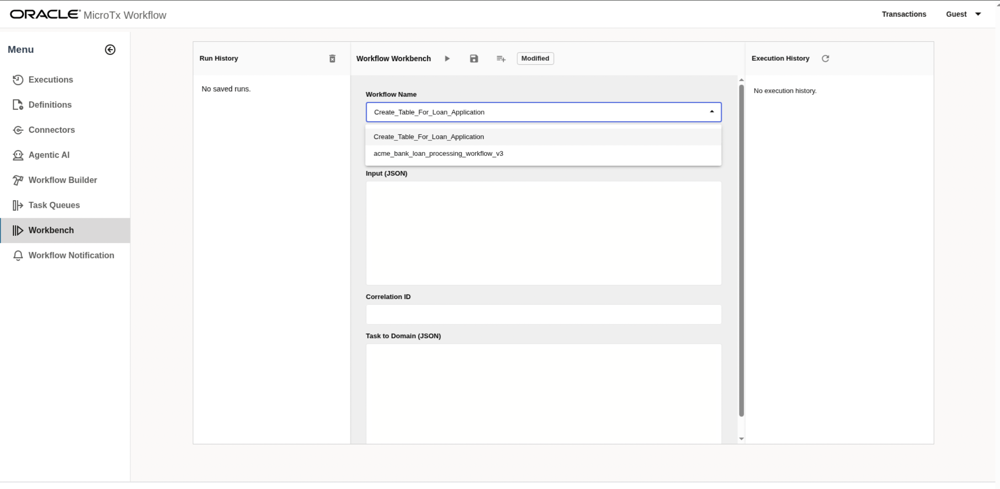

---
11. View the execution of `Create_Table_For_Loan_Application` workflow

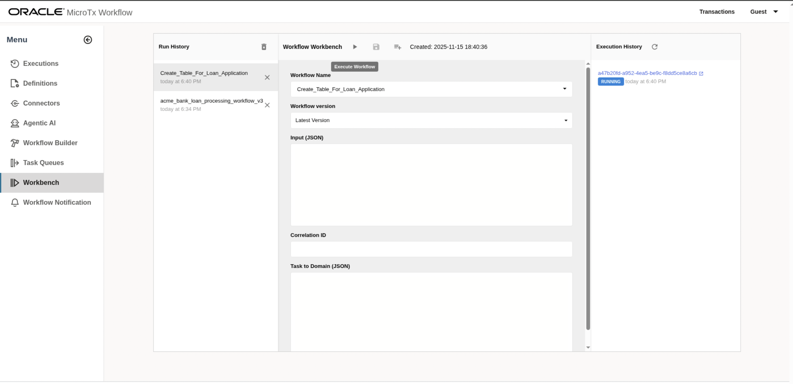

---
12. Select connectors from left pane
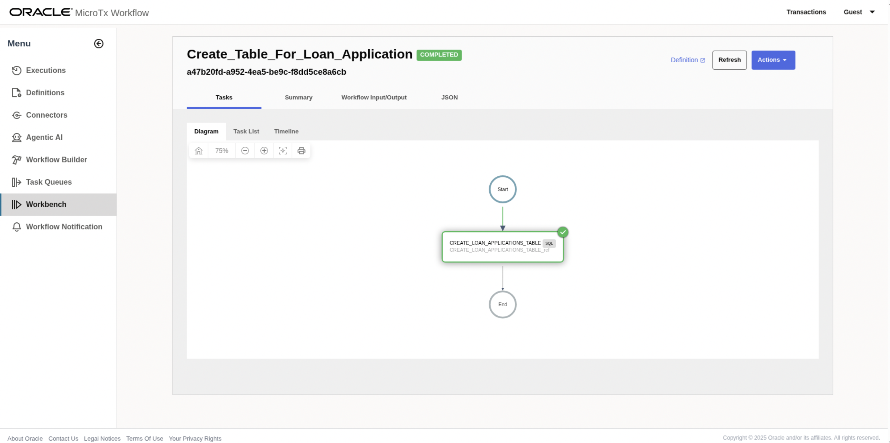

---
13. From `Workbench` menu, select `acme_bank_loan_processing_workflow_v3` workflow.

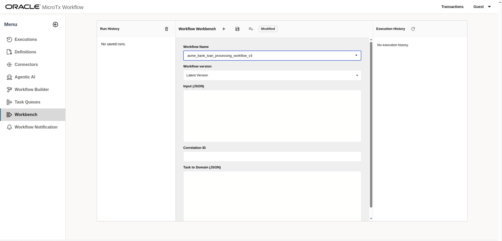

---
14. Provide below JSON payload and click `Execute Workflow`.
   A workflow run link appears on right side `Execution History`, click on that

```json
{
  "loan_application_text": "I am looking for the $3000 loan for 3 years tenure. Provide me best interest rate and terms. My ssn number is 123-45-6789",
  "document": "https://raw.githubusercontent.com/oracle-samples/microtx-samples/2fc203578ddd544af796aaf0bf270ae3978b78e7/workflow/loan-application/ocr-microservice/samples_for_ocr/driving-license.png"
}
```

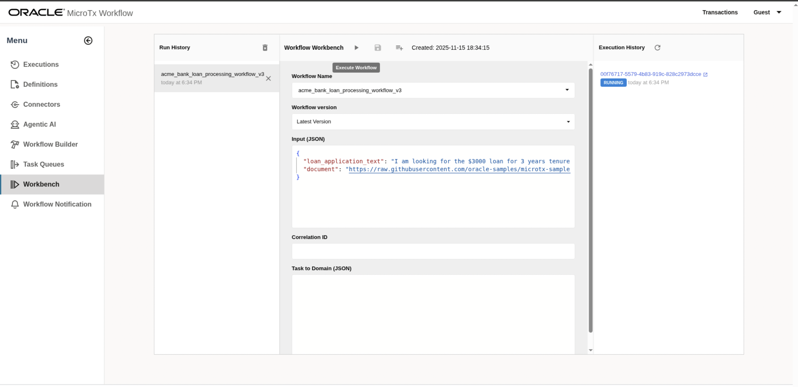

---
15. View the execution of `acme_bank_loan_processing_workflow_v3` workflow
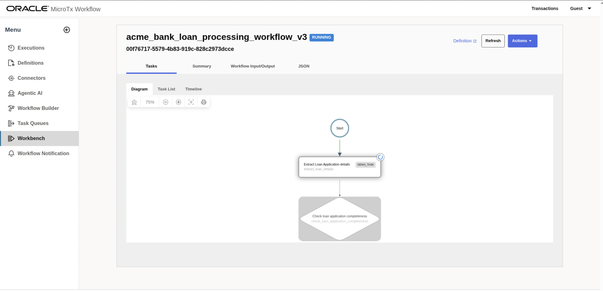

---
16. Once Workflow Executon reaches the `Human_approval_task`, workflow expects user to act on notification, which is used to approve or reject the loan.
To view the notification, from `Menu` clik on `Workflow Notification` 


17. Click on notification and either `Approve` or `Reject`


18. From `Menu`, click on `Executions`, click on the workflow `acme_bank_loan_processing_workflow_v3` execution link with recent workflow id and see the workflow status.


19. User can login to the database and verify the Loan application status from the table using below query.

```sql
SELECT * FROM LOAN_APPLICATIONS WHERE ID ='workflow-execution-id';
```

