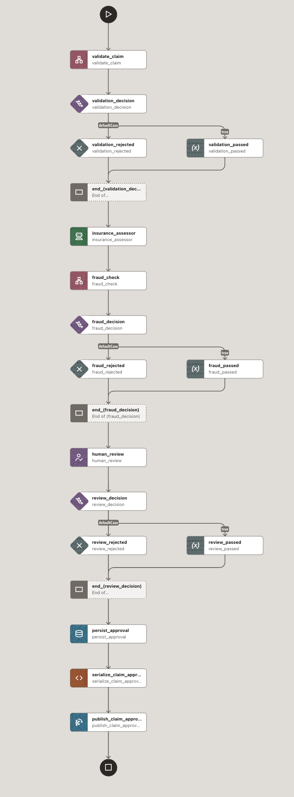

# Insurance Claim Processing — Sample Agentic Workflow

This sample demonstrates event-driven insurance claim processing using Oracle MicroTx Workflows. It combines an AI-assisted damage assessment, HTTP services mocked in Postman, human approval, Oracle SQL tasks, and TxEventQ events.

The process is split into two workflows: `claim_assessment` assesses and approves the claim, and `claim_settlement` processes its payment. A `claim.approved` event connects the workflows so they can execute independently.



## What This Sample Demonstrates

- Use an Agentic task to extract damage and repair facts for a human reviewer.
- Call Postman mock services for validation, fraud screening, and payment processing.
- Pause for an adjuster to approve or reject a claim.
- Store approval and settlement records in Oracle Database.
- Start a second workflow through a TxEventQ event handler.
- Poll payment status with a five-second wait between checks.

The service responses and severity scoring are for demonstration only. The AI does not approve claims or initiate payments.

## Workflow Overview

### 1. Claim Assessment

The `claim_assessment` workflow performs majorly these steps:

1. **Validate Claim:** Call the validation mock API and continue only when its `result` is true.
2. **AI Assessment:** Read the returned claim and pre-extracted document text, extract damage facts, and produce a severity assessment. Validate the AI response before passing it downstream.
3. **Fraud Check:** Send the claim and assessment to the fraud-screening mock API.
4. **Human Review:** Wait for an adjuster to approve or reject the claim and enter the approved amount.
5. **Persist Approval:** Insert the approved claim into `CLAIM_APPROVALS`.
6. **Publish Event:** Publish `claim.approved` to `insurance_claim_queue`.

Validation failure, fraud rejection, or adjuster rejection prevents approval persistence and event publication. Technical errors, including invalid AI output, fail the workflow.

### 2. Claim Settlement

The `claim_approved_start_settlement` event handler consumes the approval event and starts `claim_settlement`:

1. **Create Settlement:** Insert a `PAYMENT_PENDING` record into `CLAIM_SETTLEMENTS`.
2. **Initiate Payment:** Call `POST /payments`, expecting HTTP **201** and a payment ID.
3. **Check Payment Status:** Wait five seconds, then call `GET /payments/{paymentId}/status` inside a `DO_WHILE` loop.
4. **Handle Outcome:** Repeat for `PENDING`, continue for `SETTLED`, or fail the workflow for `FAILED`. Exhausting the configured polling limit also fails the workflow.
5. **Complete Settlement:** Update the settlement record to `SETTLED` and publish `claim.settled`.

The default polling limit is 60 checks. No payment callback is required.

## Prerequisites

- A running MicroTx Workflows server and access to its console.
- An Oracle database profile named `insurance_database`, with access to the tables and queues used by this sample.
- An LLM connector and a Workflow-capable agent profile for assessment.
- Postman mock servers created from the supplied collections.
- TxEventQ support enabled on the server, with the queues and subscribers configured.


## Configure the Database

In the console's **Connectors → Database** section, configure `insurance_database` for the schema that will hold the following tables. Run this SQL in that schema if the tables do not already exist:

```sql
CREATE TABLE CLAIM_APPROVALS (
    ID               NUMBER GENERATED ALWAYS AS IDENTITY
                     (START WITH 1 INCREMENT BY 1) PRIMARY KEY,
    CLAIM_ID         VARCHAR2(100) NOT NULL,
    APPROVED_AMOUNT  NUMBER(19, 2) NOT NULL,
    APPROVAL_TYPE    VARCHAR2(20) NOT NULL,
    REVIEWER_ID      VARCHAR2(100) NOT NULL,
    STATUS           VARCHAR2(30) DEFAULT 'APPROVED' NOT NULL,
    UPDATED_AT       TIMESTAMP WITH TIME ZONE DEFAULT SYSTIMESTAMP NOT NULL
);

CREATE TABLE CLAIM_SETTLEMENTS (
    ID               NUMBER GENERATED ALWAYS AS IDENTITY
                     (START WITH 1 INCREMENT BY 1) PRIMARY KEY,
    WORKFLOW_ID      VARCHAR2(100) NOT NULL,
    CLAIM_ID         VARCHAR2(100) NOT NULL,
    APPROVED_AMOUNT  NUMBER(19, 2) NOT NULL,
    APPROVAL_TYPE    VARCHAR2(20) NOT NULL,
    STATUS           VARCHAR2(30) DEFAULT 'PAYMENT_PENDING' NOT NULL,
    PAYMENT_ID       VARCHAR2(100),
    UPDATED_AT       TIMESTAMP WITH TIME ZONE DEFAULT SYSTIMESTAMP NOT NULL
);
```

Both tables use a generated numeric `ID` as the primary key. `CLAIM_ID` is not unique, so independent demo executions can create multiple rows for the same claim. Settlement updates match `WORKFLOW_ID` to avoid updating another execution's rows.

These statements create the business tables only. The supplied assessment workflow also enables SQL-task idempotency using `fenced_task_idempotency_lock`; ensure the MicroTx idempotency infrastructure required by your installation is provisioned. Do not drop existing tables to repeat the demo.

## Configure the Mock Services in Postman

Import the following collections into Postman and create a collection-based mock server for each:

| Collection | Services |
| --- | --- |
| Validate Claim | POST /claims/validate |
| Fraud Check Claim | POST /claims/fraud-check|
| Start The Payment Settelement| POST /payments |
| get the payment status | GET /payments/{paymentId}/status |


Use public mocks only for synthetic data. Copy each server's base URL into that collection's `mockApiBaseUrl` variable. These services return saved examples; they do not perform real claim checks or payments. For creation steps, see [Postman's collection mock setup](https://learning.postman.com/docs/design-apis/mock-apis/set-up-mock-servers#create-from-a-collection).

The assessment inputs `validationMockResponse` and `fraudMockResponse` select `validation-pass` and `fraud-pass`. Use `validation-fail` or `fraud-fail` to demonstrate rejection.

For settlement, set `inputTemplate.mockApiBaseUrl` in [claim_settlement_workflow.json](claim_settlement_workflow.json) to the **payment** mock URL before registering the workflow. Keep `paymentMockResponse` as `payment-accepted` and select `payment-status-settled`, `payment-status-failed`, or `payment-status-pending` through `paymentStatusMockResponse`.

Postman variables do not change MicroTx workflow inputs. The two mock servers have separate URLs. The supplied examples use fixed sample data, so update saved claim fields if you want them to match a different demo claim ID.

## Configure the Workflows and Event Handler

1. Register [claim_assessment_workflow](insurance_claim_assessment_workflow.json) as `claim_assessment`.
2. Register [claim_settlement_workflow.json](insurance_claim_settlement_workflow.json) as `claim_settlement`, after setting its payment mock URL.
3. Ensure the approval queue `insurance_claim_queue` has subscriber `approvalAgent`, and the final queue `insurance_settlement_queue` has subscriber `settlementAgent` in the database selected by `insurance_database`.
4. Enable TxEventQ support with `conductor.event-queues.txeventq.enabled=true` in the server configuration.
5. Register or update [claim_approved_event_handler.json](claim_approved_event_handler.json). Its event binding is `txeventq:insurance_claim_queue:approvalAgent:insurance_database`; it starts settlement. To create a TxEventQ in Oracle database refer [README.md](../invoice-processing/README.md)

Do not add trailing spaces to agent/subscriber names. Update an existing handler rather than creating another handler that also starts settlement. For queue and registration details, see [settlement setup](README-claim-settlement-demo.md).

## Trigger the Workflow

1. Open the MicroTx console and navigate to **Workflows → Workbench**.
2. Select **claim_assessment**.
3. Enter the following JSON in the workflow input field:

```json
{
  "config": {
    "ServiceBaseUrl": "https://3ab5c483-65f9-4e5a-97ab-7d604600d6b4.mock.pstmn.io",
    "validationMockResponse": "validation-pass",
    "fraudMockResponse": "fraud-pass"
  },
  "claimDetails": {
    "claimId": "CLAIM-1256",
    "correlationId": "claim-98371",
    "approvalEventId": "evt-claim-98371-approved-001",
    "causationId": "evt-claim-98371-submitted-001",
    "occurredAt": "2026-09-24T09:00:00Z",
    "claim": {
      "policyId": "POL-MOTOR-2026-001",
      "claimant": {
        "customerId": "CUSTOMER-001",
        "name": "Asha Demo"
      },
      "vehicle": {
        "registrationNumber": "DEMO-98371",
        "make": "Example Motors",
        "model": "City",
        "year": 2024
      },
      "incident": {
        "date": "2026-09-20",
        "type": "COLLISION",
        "location": "Bengaluru",
        "description": "Low-speed collision damaged the front bumper and left headlamp. No injuries reported."
      },
      "requestedAmount": 12500,
      "currency": "INR",
      "documents": [
        {
          "documentId": "DOC-001",
          "type": "REPAIR_ESTIMATE",
          "fileName": "repair-estimate.txt",
          "extractedText": "Front bumper replacement INR 8000; left headlamp INR 3500; labour INR 1000. Total INR 12500."
        }
      ]
    }
  }
}
```

Here, **`ServiceBaseUrl` is your Postman claim-assessment mock server's base URL**, without a trailing slash. Replace the example URL with the URL you copied from Postman. It is not the MicroTx server URL or the payment mock URL.

| Input | Purpose |
| --- | --- |
| claimId | Claim identifier stored in the business records and approval event |
| mockApiBaseUrl | Base URL for the validation and fraud mock APIs |
| validationMockResponse | Saved validation response example to select |
| fraudMockResponse | Saved fraud response example to select |
| approvalEventId | ID assigned to the published approval event |
| correlationId | Identifier used to trace the claim across both workflows |
| causationId | ID of the preceding business event that caused this assessment |
| occurredAt | Demo event timestamp, supplied in ISO-8601 UTC format |

The input above is retained as provided: `claimId` uses `1256`, while its event and correlation IDs use `98371`. Those fields are independent strings, but use consistent identifiers for a clear presentation. Give each new independent approval a fresh `approvalEventId` and use an appropriate timestamp. The timestamp is supplied demo metadata, not automatically generated at approval time.

4. Click **Execute Workflow**.
5. Open the new run from **Execution History** to monitor validation, AI assessment, and fraud screening.

## Complete the Human Review

1. When execution reaches `human_review`, open **Workflow Notification** and select **Actions/Act** for that task.
2. Review the claim and AI assessment in the task details.
3. To approve, check `approved`, enter the approved amount and reviewer ID, and retain `approvalType: MANUAL`.
4. Submit the task with status **COMPLETED**.

For rejection, leave `approved` unchecked and submit with task status COMPLETED. The workflow reads the boolean decision; submitting task status FAILED is a technical failure, not a business rejection.

Approval inserts a record into `CLAIM_APPROVALS` and publishes `claim.approved`. The event handler starts settlement automatically; do not manually start a second settlement for the same demonstration.

## Verify the Result

Open the `claim_settlement` execution and inspect its payment status checks. With the default settled response, it proceeds after the first five-second wait to update the settlement and publish `claim.settled`. A failed payment or exhausted polling limit produces a FAILED workflow and no final settled event.

Check the database records:

```sql
SELECT * FROM CLAIM_APPROVALS
WHERE CLAIM_ID = 'CLAIM-1256'
ORDER BY ID DESC;

SELECT * FROM CLAIM_SETTLEMENTS
WHERE CLAIM_ID = 'CLAIM-1256'
ORDER BY ID DESC;
```

For a successful run, approval status is `APPROVED` and settlement status is `SETTLED`, with a payment ID recorded. If the pending example is selected, it stays pending until that saved response is changed or the polling limit is reached.

This guide follows the sample-oriented organization of Oracle's [loan application README](https://github.com/oracle-samples/microtx-samples/blob/main/workflow/loan-application/README.md), using the claim demo's own workflow definitions and schemas.