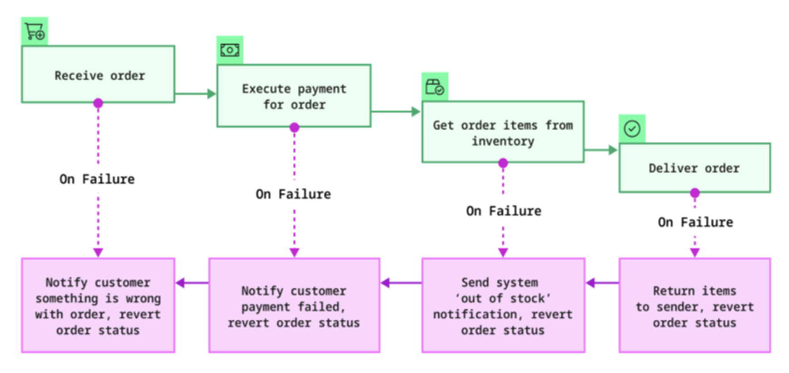
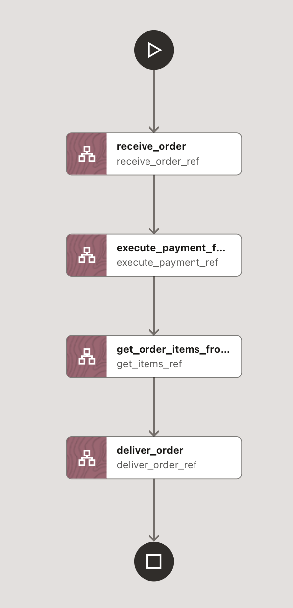
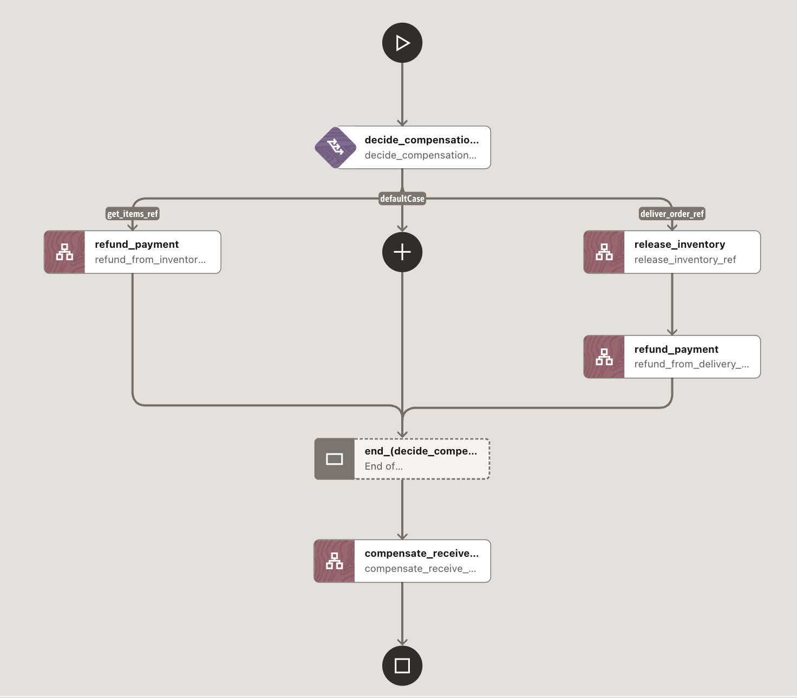

# Order Processing Saga Workflow



## What we're trying to do

Orchestrate a realistic e-commerce order using the Saga pattern in MicroTx Workflows:
- Model a happy path with discrete REST tasks, and define compensations that reliably roll back side effects when a step fails
- Run the entire scenario using Postman Mock Servers (no backend services required)

## Workflow Diagrams

Forward Saga workflow:


Compensation workflow:


## Repository Contents

- Workflows
  - [workflows/order_processing_saga_workflow.json](./workflows/order_processing_saga_workflow.json)
  - [workflows/order_processing_compensation_workflow.json](./workflows/order_processing_compensation_workflow.json)
- Postman
  - [postman/Order Processing Saga.postman_collection.json](./postman/Order%20Processing%20Saga.postman_collection.json)

## Architecture

Forward workflow (order_processing_saga_workflow.json):
1. receive_order: POST {baseUri}/api/orders
2. execute_payment_for_order: POST {baseUri}/api/payments
3. get_order_items_from_inventory: POST {baseUri}/api/inventory/debit
   - Uses header `x-mock-response-code` to select a mock response via the `statusCode` input (e.g., 200 for success, 409 for inventory conflict)
4. deliver_order: POST {baseUri}/api/shipments

Compensation workflow (order_processing_compensation_workflow.json):
- Detects which task failed (inventory debit or delivery)
- Executes compensation accordingly:
  - If inventory failed: refund payment
  - If delivery failed: release inventory (credit) and refund payment
- Finally, cancel the order

## Import Workflows into MicroTx Workflow Server

Follow the general steps in [../README.md](../README.md) (Definitions -> Workflows -> + -> JSON tab) and import both:
- [./workflows/order_processing_saga_workflow.json](./workflows/order_processing_saga_workflow.json)
- [./workflows/order_processing_compensation_workflow.json](./workflows/order_processing_compensation_workflow.json)

Ensure the `failureWorkflow` in the main workflow points to `order_processing_compensation_workflow` (it does by default in this sample).

## Run Mock Services with Postman

You can run this sample entirely with Postman Mock Servers. The provided collection includes example responses for success and failure.

Steps:
1. Import the Postman collection:
   - File: [./postman/Order Processing Saga.postman_collection.json](./postman/Order%20Processing%20Saga.postman_collection.json)
   - In Postman: File -> Import -> Select the JSON file
2. Create a Mock Server from the collection:
   - In Postman, open the collection "Order Processing Saga"
   - Click the three dots (...) -> Mock collection
   - In the dialog:
     - Environment: None (or pick/create one if you prefer)
     - Provide a mock server name
     - Click "Create Mock Server"
   - Copy the generated base URL, for example:
     - https://xxxxxxxx-xxxx-xxxx-xxxx-xxxxxxxxxxxx.mock.pstmn.io
3. Update Postman variables to use the mock base URL:
   - In Postman, open the "Order Processing Saga" collection -> Variables tab
   - Set the following variables to the mock base URL you copied above:
     - base_url_order_service
     - base_url_payment_service
     - base_url_inventory_service
     - base_url_delivery_service
   - Save the collection after updating variables
4. Test the mock endpoints (optional):
   - Use the "Send" button on a request or curl a mock endpoint:
```bash
curl -X POST "https://...mock.pstmn.io/api/orders" -H "Content-Type: application/json" -d '{ "orderId": "ORD-12345", "items": [{"itemId":"ITEM-A","quantity":2}], "amount": 99.99, "deliveryAddress": "Banglore" }'
```
   - Inventory failure simulation:
     - Add header `x-mock-response-code: 409` to receive the "Out of Stock" example response

Note on hosts and variables in the collection:
- Requests resolve their base URL from the per-service variables listed above. Set each of them to the same mock base URL to use Postman mocks.

## Execute the Workflow

When starting the workflow in MicroTx, supply the input parameters as JSON. The workflow expects a single `baseUri` for all endpoints. For Postman mocks, use the mock server base URL.

Example: Success path
```json
{
  "baseUri": "https://<your_mock_id>.mock.pstmn.io",
  "orderId": "ORD-12345",
  "items": [[
    {"itemId": "ITEM-A", "quantity": 2}, {"itemId": "ITEM-B", "quantity": 1}
    ]],
  "amount": 99.99,
  "deliveryAddress": "Banglore",
  "statusCode": 200
}
```

Example: Trigger compensation (Inventory conflict)
```json
{
  "baseUri": "https://<your_mock_id>.mock.pstmn.io",
  "orderId": "ORD-12345",
  "items": [[
    {"itemId": "ITEM-A", "quantity": 2}, {"itemId": "ITEM-B", "quantity": 1}
    ]],
  "amount": 99.99,
  "deliveryAddress": "Banglore",
  "statusCode": 409
}
```

- The `statusCode` controls the inventory debit mock response using Postman&#39;s `x-mock-response-code` header set in the workflow.
- If `statusCode` = 409, the "Debit Inventory" task fails, which triggers the compensation workflow:
  - Refund payment
  - Cancel order

Note:
- The deliver step in this sample provides a success example in the collection. You can extend the collection with a 500 example under "Deliver Order" and adapt the main workflow to pass `x-mock-response-code` similarly if you want to demo delivery failures as well.

## Using Real Services

If you have real services deployed behind an API gateway:
- Set `baseUri` to your gateway base URL (for example, https://api.example.com)
- Ensure the following paths exist and return compatible JSON:
  - POST {baseUri}/api/orders
  - POST {baseUri}/api/payments
  - POST {baseUri}/api/inventory/debit
  - POST {baseUri}/api/inventory/credit (compensation)
  - POST {baseUri}/api/payments/refund (compensation)
  - POST {baseUri}/api/orders/cancel (compensation)

## Verifying Execution

- On success (statusCode 200), the workflow output includes `shipmentDetails` from the delivery step.
- On failure (statusCode 409), the compensation workflow runs. Verify:
  - Refund invoked
  - Order canceled
  - If you extend for delivery failure, inventory credit + refund + cancel are invoked
