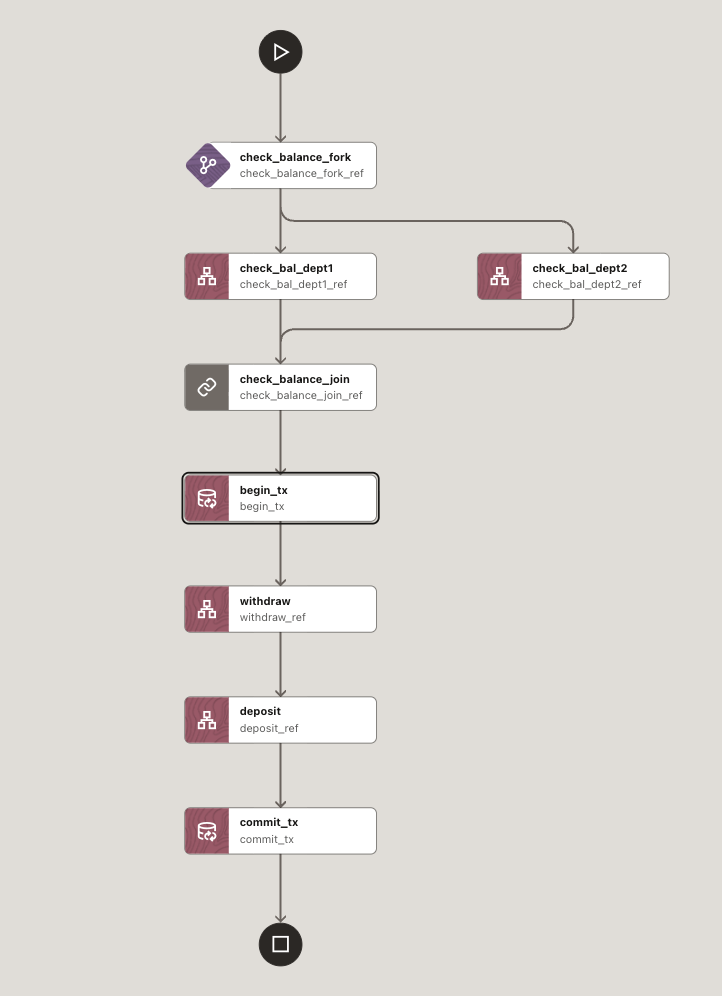
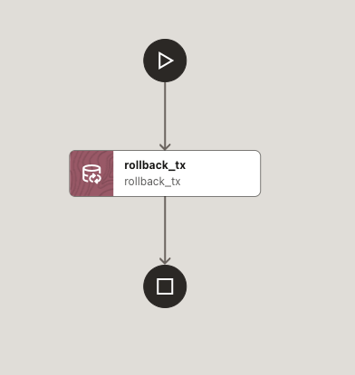

# Payment processing using XA transactions


_Figure 1: XA transaction workflow_


_Figure 2: Rollback failure workflow_

## Business problem
Payment flows often span multiple independent systems. For example, debit a user's internal account balance and credit an external account. These operations must be atomic: either both succeed, or both fail. Otherwise, you risk inconsistent states (e.g., source account is debited but destination account is not credited).

## What's in this folder
- [xa-transaction-wf.json](./xa-transaction-wf.json) — Main XA workflow definition (`transaction_xa`)
- [xa-failure-wf.json](./xa-failure-wf.json) — Failure/rollback workflow (`rollback_txn`)
- `xa-wf.png` — Diagram of the main workflow
- `xa-failure-wf.png` — Diagram of the failure workflow

## What this workflow does (overview)
The workflow orchestrates a money transfer under a single XA transaction coordinated by MicroTx:
1. Checks both source and destination account balances in parallel.
2. Begins an XA transaction (global transaction).
3. Executes business operations within the XA transaction boundary:
   - Withdraw from the source account.
   - Deposit to the destination account.
4. Commits the XA transaction if all steps succeed.
5. If any step fails, invokes a failure workflow that rolls back the XA transaction.

## Task-by-task breakdown
Based on `xa-transaction-wf.json`:
- `check_balance_fork` (FORK_JOIN)
  - `check_bal_dept1` (HTTP GET): `http://host.docker.internal:8081/accounts/${workflow.input.from}`
  - `check_bal_dept2` (HTTP GET): `http://host.docker.internal:8082/accounts/${workflow.input.to}`
- `check_balance_join` (JOIN): waits for both balance checks.
- `begin_tx` (TRANSACTION):
  - `coordinatorUrl: http://host.docker.internal:9000/api/v1`
  - `transactionType: "XA"`, `action: "BEGIN"`
- `withdraw` (HTTP POST):
  - `http://host.docker.internal:8081/accounts/${workflow.input.from}/withdraw?amount=${workflow.input.amount}`
- `deposit` (HTTP POST):
  - `http://host.docker.internal:8082/accounts/${workflow.input.to}/deposit?amount=${workflow.input.amount}`
- `commit_tx` (TRANSACTION):
  - `coordinatorUrl: http://host.docker.internal:9000/api/v1`
  - `transactionType: "XA"`, `action: "COMMIT"`

Failure path (`xa-failure-wf.json`):
- `rollback_tx` (TRANSACTION):
  - `coordinatorUrl: http://host.docker.internal:9000/api/v1`
  - `transactionType: "XA"`, `action: "ROLLBACK"`

## Inputs
`transaction_xa` expects:
- `from` — source account identifier (string)
- `to` — destination account identifier (string)
- `amount` — transfer amount (number)

Example:
```json
{
  "from": "account1",
  "to": "account2",
  "amount": 100
}
```

## Required microservices (existing in this repo)
The workflow calls two existing account microservices that expose the expected REST APIs.

- Department (Helidon) — dept1 (port 8081)
  - Repo path: `xa/java/department-helidon`
  - Endpoints:
    - GET `/accounts/{accountId}`
    - POST `/accounts/{accountId}/withdraw?amount={amount}`
    - POST `/accounts/{accountId}/deposit?amount={amount}`
  - Code reference: `xa/java/department-helidon/src/main/java/com/oracle/mtm/sample/resource/AccountsResource.java`

- Department (Spring) — dept2 (port 8082)
  - Repo path: `xa/java/department-spring`
  - Endpoints:
    - GET `/accounts/{accountId}`
    - POST `/accounts/{accountId}/withdraw?amount={amount}`
    - POST `/accounts/{accountId}/deposit?amount={amount}`

Quick-start alternatives (embedded DB, no external DB required):
- Helidon Embedded (dept1 at 8081): `xa/java/department-helidon-embedded`
- Spring Embedded (dept2 at 8082): `xa/java/department-spring-embedded`

Transaction Coordinator (required):
- MicroTx Transaction Coordinator API is expected at `http://host.docker.internal:9000/api/v1`.

## How to run

You can run locally from source (recommended for quick start using embedded services) or deploy on Kubernetes using the provided Helm chart for the microservices.

### Option A — Run everything locally (quick start with embedded DB)
Prerequisites:
- JDK 17+
- Maven
- Docker (to run the Transaction Coordinator)

1) Start Transaction Coordinator (Docker)
- On macOS/Windows Docker Desktop, `host.docker.internal` resolves automatically.
- Run:
```bash
docker run --name otmm -p 9000:9000/tcp \
  -e LISTEN_ADDR="0.0.0.0:9000" \
  -e INTERNAL_ADDR="http://localhost:9000" \
  -e EXTERNAL_ADDR="http://localhost:9000" \
  -e SERVE_TLS_ENABLED=false \
  -e XA_COORDINATOR_ENABLED=true \
  -e LRA_COORDINATOR_ENABLED=true \
  -e TCC_COORDINATOR_ENABLED=true \
  -d container-registry.oracle.com/database/otmm:latest
```
Coordinator API: `http://localhost:9000/api/v1`

2) Start dept1 (Helidon Embedded) on port 8081
```bash
cd xa/java/department-helidon-embedded
export ORACLE_TMM_CALLBACK_URL="http://host.docker.internal:8081"
mvn clean package
java -jar target/department-helidon-embedded.jar
```

3) Start dept2 (Spring Embedded) on port 8082
```bash
cd xa/java/department-spring-embedded
export ORACLE_TMM_CALLBACK_URL="http://host.docker.internal:8082"
export SPRING_MICROTX_PARTICIPANT_URL="http://host.docker.internal:8082"
mvn clean package
java -jar target/department-spring-embedded.jar
```

4) Validate the services (optional)
```bash
curl "http://localhost:8081/accounts/account1"
curl "http://localhost:8082/accounts/account2"
```

5) Import and run the workflow
- Import both JSONs into MicroTx Workflows (see [workflow/README.md](../README.md) for how to import JSON).
  - [./xa-transaction-wf.json](./xa-transaction-wf.json)
  - [./xa-failure-wf.json](./xa-failure-wf.json)
- Start the workflow with:
```json
{
  "from": "account1",
  "to": "account2",
  "amount": 100
}
```

### Option B — Run locally against real databases (XA DataSource)
Use the non-embedded microservices and provide XA datasource connection details.

1) dept1 (Helidon) at 8081
```bash
cd xa/java/department-helidon
export ORACLE_TMM_CALLBACK_URL="http://host.docker.internal:8081"
export DEPARTMENTDATASOURCE_URL="jdbc:oracle:thin:@tcps://<host>:<port>/<service_name>?wallet_location=Database_Wallet"
export DEPARTMENTDATASOURCE_USER="<db_user>"
export DEPARTMENTDATASOURCE_PASSWORD="<db_password>"
# (Optionally copy wallet files into ./Database_Wallet if using ADB)
mvn clean package
java -jar target/department.jar
```

2) dept2 (Spring) at 8082
```bash
cd xa/java/department-spring
export ORACLE_TMM_CALLBACK_URL="http://host.docker.internal:8082"
export SPRING_MICROTX_PARTICIPANT_URL="http://host.docker.internal:8082"
export DEPARTMENTDATASOURCE_URL="jdbc:oracle:thin:@tcps://<host>:<port>/<service_name>?wallet_location=Database_Wallet"
export DEPARTMENTDATASOURCE_USER="<db_user>"
export DEPARTMENTDATASOURCE_PASSWORD="<db_password>"
# (Optionally copy wallet files into ./Database_Wallet if using ADB)
mvn clean package
java -jar target/department.jar
```

Coordinator: same as Option A.

### Option C — Deploy microservices to Kubernetes with Helm
A Helm chart for the XA transfer microservices (teller + dept1 + dept2) is provided.

- Chart path: `xa/java/helmcharts/transfer`
- Default values: `xa/java/helmcharts/transfer/values.yaml`

Steps (example using your own values file):
```bash
# Create namespace (example)
kubectl create ns otmm

# Install the chart with your values (set images and DB connection details)
helm install -n otmm transfer xa/java/helmcharts/transfer -f my-values.yaml
```
Notes:
- When using real databases, set the datasource URL, user, and password for both departments in your values file.
- To simplify end-to-end setup (including coordinator and Istio on Minikube/OKE), you can also use the interactive script at repo root:
  - `./runme.sh` (choose: XA, then Embedded or XA DataSource, then platform)

## Expected behavior
- On success: both debit and credit occur within the XA transaction, followed by COMMIT.
- On failure: the failure workflow triggers ROLLBACK of the XA transaction, restoring consistency.

## Coordinator and endpoints used by this workflow
- Transaction Coordinator: `http://host.docker.internal:9000/api/v1`
- dept1 Accounts (Helidon): `http://host.docker.internal:8081`
- dept2 Accounts (Spring): `http://host.docker.internal:8082`

These must be reachable from the Workflow Server runtime.

## References
- MicroTx Workflows: see `workflow/README.md` for importing and running workflows
- XA Java samples: `xa/java/*`
- Helm charts for XA microservices: `xa/java/helmcharts/transfer`
