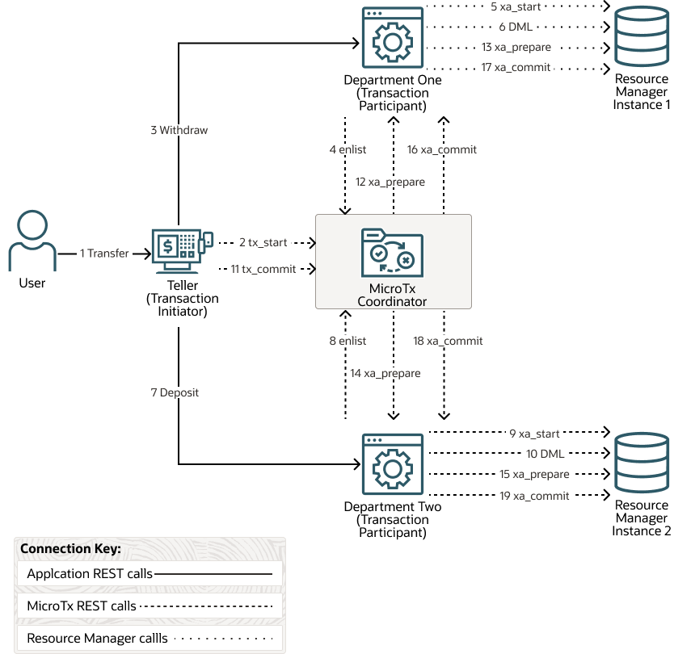

<!-- TOC start (generated with https://github.com/derlin/bitdowntoc) -->

- [About the Bank Transfer Application](#about-the-bank-transfer-application)
- [Identify a Sample Application to Run](#identify-a-sample-application-to-run)
- [Set Up Resource Managers for the Microservices](#set-up-resource-managers-for-the-microservices)
   * [Set Up an XA-Compliant Resource Manager](#set-up-an-xa-compliant-resource-manager)
   * [Create a Table and Populate it with Sample Values](#create-a-table-and-populate-it-with-sample-values)
- [Run the Bank Transfer Application on Local Machine](#run-the-bank-transfer-application-on-local-machine)
   * [Update the application.yaml File with Resource Manager Details](#update-the-applicationyaml-file-with-resource-manager-details)
   * [Build the Application on Your Local Machine](#build-the-application-on-your-local-machine)
   * [Run the Bank Transfer Application to Transfer an Amount](#run-the-bank-transfer-application-to-transfer-an-amount)
- [Run the Bank Transfer Application in Kubernetes](#run-the-bank-transfer-application-in-kubernetes)
   * [Build Docker Images for Bank Transfer Application](#build-docker-images-for-bank-transfer-application)
   * [Push the Bank Transfer Application Images](#push-the-bank-transfer-application-images)
   * [Update the values.yaml File for the Bank Transfer App](#update-the-valuesyaml-file-for-the-bank-transfer-app)
   * [Install the Bank Transfer Application](#install-the-bank-transfer-application)
   * [Run the Bank Transfer Application to Transfer an Amount](#run-the-bank-transfer-application-to-transfer-an-amount-1)
- [Run the Bank Transfer Application in Docker Swarm](#run-the-bank-transfer-application-in-docker-swarm)
   * [Build and Push the Docker Images](#build-and-push-the-docker-images)
   * [Install the Bank Transfer Application](#install-the-bank-transfer-application-1)
   * [Run the Bank Transfer Application](#run-the-bank-transfer-application)

<!-- TOC end -->

<!-- TOC --><a name="about-the-bank-transfer-application"></a>
# About the Bank Transfer Application

The Bank Transfer application contains several microservices that interact with each other to withdraw and deposit an amount. When you run the Bank Transfer application, it withdraws an amount from one department and deposits it to another department by creating an XA transaction. The two departments are Department One (Dept 1) and Department Two (Dept 2). Within the XA transaction, all actions such as withdraw and deposit either succeed, or they all are rolled back in case of a failure of any one or more actions.

The Bank Transfer application uses the XA transaction protocol and MicroTx to coordinate the transactions. The MicroTx libraries are already integrated with the sample application code. Let's use this application to understand how microservices and MicroTx interact with each other in a transaction that uses the XA transaction protocol.

The following figure shows the various microservices that are available in the Bank Transfer application and the REST API calls that are made betwen the microservices, MicroTx, and resource manager.



*   MicroTx coordinator manages transactions amongst the participant services.
*   Teller microservice initiates the transactions, so it is called an XA transaction initiator service. The user interacts with this microservice to transfer money between departments One and Two. When a new request is created, the helper method that is exposed in the MicroTx library runs the `begin()` method for XA transaction to start the XA transaction at the Teller microservice. This microservice also contains the business logic to issue the XA commit and roll back calls.
*   Department One and Department Two participate in the transactions, so they are called as XA participant services. The MicroTx library includes headers that enable the participant services to automatically enlist in the transaction. These microservices expose REST APIs to get the account balance and to withdraw or deposit money from a specified account. They also use resources from resource manager.

Resource managers manage stateful resources such as databases, queuing or messaging systems, and caches.

The service must meet ACID requirements, so an XA transaction is initiated and both withdraw and deposit are called in the context of this transaction.

<!-- TOC --><a name="identify-a-sample-application-to-run"></a>
# Identify a Sample Application to Run

The following table lists the combination of the microservices that you can use to try out different scenarios. You'll need this information when you build images of the sample microservices and configure them. Identify the scenario that you want to try out, and then note down the location of the source code for the sample application. The sample application code files are already updated to use the MicroTx client libraries. You can also use these files as a reference when you are integrating MicroTx library code with your custom application.

The Teller service is a transaction initiator service. Dept 1 and Dept 2 services are transaction participants services. You must set up a resource manager for all the transaction participant services. 

| Location of Sample Code                                                                                                                                                                                                                                                                  | Scenario | Notes                                                                                                                                                                                                         | 
|------------------------------------------------------------------------------------------------------------------------------------------------------------------------------------------------------------------------------------------------------------------------------------------| ------------- |---------------------------------------------------------------------------------------------------------------------------------------------------------------------------------------------------------------|
| [`docker-compose`](docker-compose/)                                                                                                                                                                                                                                                      | YAML file where you must provide details to configure and deploy the sample applications in Docker Swarm environments. |
| Initiator app: [`java/teller/`](java/teller/)<br>Dept 1: [`java/department-helidon/`](java/department-helidon/)<br>Dept 2: [`java/department-spring/`](/java/department-spring/)                                                                                                         | Run Java sample applications using only XA-compliant resource managers. The Teller service only initiates the transaction and does not participate in it, so it does not require a resource manager. | Set up XA-compliant resource managers for Dept 1 and Dept 2. |                                                                                                                                                  
| Initiator app: [`java/teller-as-participant/`](java/teller-as-participant/)<br>Dept 1: [`java/department-helidon/`](java/department-helidon/)<br>Dept 2: [`java/department-spring/`](java/department-spring/)                                                                            | Run Java sample applications using only XA-compliant resource managers. The Teller service initiates, and then participates in the transaction, so it also requires a resource manager. | Set up XA-compliant resource managers for Teller, Dept 1, and Dept 2 services. |                                                                                                                                
| Initiator app: [`nodejs/teller/`](nodejs/teller/)<br>Dept 1: [`java/department-helidon/`](java/department-helidon/)<br>Dept 2: [`nodejs/department/`](nodejs/department/)                                                                                                                | Run Node.js sample applications using only XA-compliant resource managers. The Teller app only initiates the transaction and does not participate in it, so it does not require a resource manager. | Set up XA-compliant resource managers for Dept 1 and Dept 2. |                                                                                                                                                  
| Initiator app: [`java/teller`](java/teller)<br>Dept 1: [`java/department-helidon`](java/department-helidon)<br>Dept 2: [`java/department-nonxa-ds`](java/department-nonxa-ds)                                                                                                            | Run Java sample applications using an XA-compliant resource manager for Dept 1 and a resource that does not support XA and JDBC for Dept 2. The Teller service only initiates the transaction, so it does not require a resource manager. | MySQL is a JDBC resource which is not XA-compliant. Use Logging Last Resource (LLR) optimization to enable MySQL to participate in a distributed transaction. Set up MySQL as a resource manager for Dept 2.  | 
| Initiator app: [`java/teller/`](java/teller/)<br>Dept 1: [`java/department-helidon/`](java/department-helidon/)<br>Dept 2: [`java/department-nonxa/`](java/department-nonxa/)                                                                                                            | Run Java sample applications using an XA-compliant resource manager for Dept 1 and MongoDB or MySQL as resource manager for Dept 2. The Teller service only initiates the transaction, so it does not require a resource manager. | Mongo DB is a non-XA and non-JDBC resource. MySQL is a JDBC resource which is not XA-compliant. Use LLR or LRC optimization to enable MongoDB or MySQL to participate in a distributed transaction.           |          
| Initiator app: [`java/teller-as-participant-nonxa-ds/`](java/teller-as-participant-nonxa-ds/)<br>Dept 1: [`java/department-helidon/`](java/department-helidon/)<br>Dept 2: [`java/department-spring/`](java/department-spring/)                                                          | Run Java sample applications using XA-compliant resource managers for Dept 1 and Dept 2 services. The Teller service initiates, and then participates in the transaction, so you must set up a resource manager for the Teller service. | MySQL is a JDBC resource which is not XA-compliant. Use LLR optimization to enable MySQL to participate in a distributed transaction. Set up MySQL as a resource manager for the Teller service.              |             
| Initiator app: [`java/teller/`](java/teller/)<br>Dept 1: [`java/department-helidon/`](java/department-helidon/)<br>Dept 2: [`java/department-nonxa-lrc-ds/`](java/department-nonxa-lrc-ds/)                                                                                              | Run Java sample applications using an XA-compliant resource manager for Dept 1 and MySQL as resource manager for Dept 2. The Teller service only initiates the transaction, so it does not require a resource manager. | MySQL is a JDBC resource which is not XA-compliant. Use Last Resource Commit (LRC) optimization to enable MySQL to participate in a distributed transaction. Set up MySQL as a resource manager for Dept 2.   |
| Initiator app: [`java/teller/`](java/teller/)<br>Dept 1: [`java/department-helidon/`](java/department-helidon/)<br>Dept 2: [`java/department-nonxa-lrc/`](java/department-nonxa-lrc/)                                                                                                    | Run Java sample applications using an XA-compliant resource manager for Dept 1 and MongoDB as resource manager for Dept 2. The Teller service only initiates the transaction, so it does not require a resource manager. | Mongo DB is a non-XA and non-JDBC resource. Use LRC optimization to enable MongoDB to participate in a distributed transaction.                                                                               |
| Initiator app: [`java/teller/`](java/teller/)<br>Dept 1: [`java/department-helidon/`](java/department-helidon/)<br>Dept 2: [`java/department-helidon-mixed-multiplerm/`](java/department-helidon-mixed-multiplerm/)                                                                      | Run Helidon sample applications using an XA-compliant resource manager for Dept 1 and multiple resource managers for Dept 2. The Teller service only initiates the transaction, so it does not require a resource manager. | For Dept 2, set up Oracle Database as one of the resource managers and MySQL as the other.                                                                                                                    |
|  Initiator app: [`java/teller/`](java/teller/)<br>Dept 1: [`java/department-helidon-oracle-postgress-multiplerm/`](java/department-helidon-oracle-postgress-multiplerm/)<br>Dept 2: [`java/department-spring-jpa-multiplerm-postgres/`](java/department-spring-jpa-multiplerm-postgres/) | Run Java sample applications using an XA-compliant resource manager for Dept 1 and multiple resource managers for Dept 2. The Teller service only initiates the transaction, so it does not require a resource manager. | Dept 1 is a Helidon application. Dept 2 is a Spring Boot application. For Dept 2, set up Oracle Database as one of the resource managers and PostgreSQL as the other.                                         |

<!-- TOC --><a name="set-up-resource-managers-for-the-microservices"></a>
# Set Up Resource Managers for the Microservices

Set up resource managers for Department One and Department Two microservices.

For Department One, you can use any XA-compliant database as a resource manager. For example, Autonomous Transaction Processing (ATP) Database instances in Oracle Cloud.

For Department Two, set up one of the following as a resource manager based on the use case that you want to implement:

*   XA-compliant database
*   Non-XA compliant data stores, such as MongoDB and MySQL
*   PostgreSQL as database

In the use case where the Teller service initiates and then participates in a transaction, you must set up a resource manager for the Teller service.

<!-- TOC --><a name="set-up-an-xa-compliant-resource-manager"></a>
## Set Up an XA-Compliant Resource Manager

Set up XA-compliant resource managers for the Bank Transfer application, and then create tables with sample values.

You can use any Oracle Database. For example, Autonomous Transaction Processing (ATP) Database instances in Oracle Cloud, an Oracle Database running inside a Kubernetes cluster, or an on-premises database. Ensure that MicroTx and the application, when it is deployed, can access the database.

Only if you use an Autonomous Database instance, perform the following steps to get the Oracle client credentials (wallet files):

1.  Download the wallet from the Autonomous Database instance. See [Download Client Credentials (Wallets)](https://docs.oracle.com/en/cloud/paas/autonomous-database/adbsa/connect-download-wallet.html#GUID-B06202D2-0597-41AA-9481-3B174F75D4B1) in Using Oracle Autonomous Database on Shared Exadata Infrastructure.
    
    A ZIP file is downloaded to your local machine. Let's consider that the name of the wallet file is `Wallet_database.zip`.
    
2.  Unzip the wallet file.

    ```
    unzip Wallet_database.zip
    ```
    
    The files are extracted to a folder. Note down the name of this folder.
    
3.  Copy the wallet files to the following folders that contain the source code for the participant applications that use an XA-compliant resource manager. For example, `/samples/xa/java/department-helidon/Database_Wallet` or `/samples/xa/java/department-spring/Database_Wallet`.
    
<!-- TOC --><a name="create-a-table-and-populate-it-with-sample-values"></a>
## Create a Table and Populate it with Sample Values

To test the Bank Transfer application, create tables with sample values for both the department microservices. The MicroTx installation bundle includes the SQL script file that you can run to create the required tables. Run the SQL script using a client tool with which you connect to the database. You'll need to provide database credentials to establish a connection with the database and run the SQL script.

To use the SQL script to create a database, a table, and populate it with sample values:

1.  Run the `/samples/xa/java/department-helidon/department.sql` file by connecting to Oracle Database by using SQL developer or SQL plus.
    This creates a database with the name `department_helidon` and a table with the name `accounts`. It also populates the `accounts` table with sample values.
    
2.  Run the `/samples/xa/java/department-spring/department.sql` file by connecting to Oracle Database by using SQL developer or SQL plus.
    This creates a database with the name `department_spring` and a table with the name `accounts`. It also populates the `accounts` table with sample values as provided in the following table.
    
    Account\_ID | Amount
    ------------ | -------------
    account1 | 1000
    account2 | 2000
    account3 | 3000
    account4 | 4000
    account5 | 5000

<!-- TOC --><a name="run-the-bank-transfer-application-on-local-machine"></a>
# Run the Bank Transfer Applications on Local Machine

<!-- TOC --><a name="update-the-applicationyaml-file-with-resource-manager-details"></a>
## Update the application.yaml File with Resource Manager Details

In the `application.yaml` file of the sample application, provide details to access the resource managers that you have set up.

Provide the MicroTx library configuration and  callback urls in the `tmm.properties ` file for helidon based microservices. For Spring Boot based application provide MicroTx Library configuration inside the `application.yaml` file itself.

1.  Open the `application.yaml` file, which is located in the `../src/main/resources` folder of your application, in any code editor.
2.  Provide details to access the resource manager for Department 1 and Department 2 microservices.
    *   `connectString`: Enter the public URL to access the database. It can be the public IP address of the database node or the IP address of the cluster.
        *   If you are using a non-autonomous Oracle Database (a database that does not use a credential wallet), use the following format to enter the connection string:

        ```
        jdbc:oracle:thin:@<publicIP>:<portNumber>/<database unique name>.<host domain name>
        ```

        For example:

        ```
        jdbc:oracle:thin:@123.213.85.123:1521/CustDB_iad1vm.sub05031027070.customervcnwith.oraclevcn.com
        ```

        *   If you are using Oracle Database Cloud Service with Oracle Cloud Infrastructure, see [Create the Oracle Database Classic Cloud Service Connection String](https://docs.oracle.com/en/database/other-databases/blockchain-enterprise/21.1/user/create-rich-history-database.html#GUID-21A8D3B6-7FDB-4FCB-AD1B-78609DEB5D50) in Using Oracle Blockchain Platform.
        *   If you are using Oracle Autonomous Transaction Processing, use the following format to enter the connection string:
        ```
        jdbc:oracle:thin:@tcps://<host>:<port>/<service_name>?wallet_location=<wallet_dir>
        ```
        You can find the required details, such as host, port, and service name in the `tnsnames.ora` file, which is located in folder where you have extracted the wallet.
            
        For example:
        ```
        jdbc:oracle:thin:@tcps://adb.us-phoenix-1.oraclecloud.com:7777/unique_connection_string_low.adb.oraclecloud.com?wallet_location=Database_Wallet
        ```
    *   `databaseUser`: Enter the user name to access the database, such as `SYS`.
    *   `databasePassword`: Enter the password to access the database for the specific user.
    
3.  Save your changes.

<!-- TOC --><a name="build-the-application-on-your-local-machine"></a>
## Build the Application on Your Local Machine

You can run the Bank Transfer application on your local machine in one of the following ways:

*   Compile the application code and build a JAR file for each microservice. Run the JAR file in the local system.
*   Create a Docker image for each microservice on your local machine, and then run the Docker container.

Instructions for both approaches is provided for each application in the `readme` file within the application folder.

For the simple usecase for the bank Transfer . Please run the first scenario from the above table. 

#### Run Bank Microservices 
Teller 
Go to samples/xa/java/teller directory in the distribution package . Follow the Readme file present in the folder to run the Microservice.

Department-Helidon
Go to samples/xa/java/department-helidon directory in the distribution package . Follow the Readme file present in the folder to run the Microservice.

Department-spingboot 
Go to samples/xa/java/department-spring directory in the distribution package . Follow the Readme file present in the folder to run the Microservice.

<!-- TOC --><a name="run-the-bank-transfer-application-to-transfer-an-amount"></a>

### Setting up the MicroTx Coordinator Locally

Pull the latest MicroTx Docker image from the official Oracle Registry.
```
docker pull container-registry.oracle.com/database/otmm:latest
```
Before running the coordinator image make sure that the localhost port 9000 is not utilized by any other service.

```
docker run --name otmm --network=host  -v "$(pwd)":/app/config:Z -w /app/config -p 9000:9000/tcp -e storage_type="memory"  -e  serveTLS_enabled="false" -e authorization_enabled="false" -e authentication_enabled="false" -e transactionToken_transactionTokenEnabled="false" -e listenAddr="localhost:9000" -e internalAddr="http://localhost:9000" -e externalUrl="http://localhost:9000" -d container-registry.oracle.com/database/otmm:latest
```

Check the Coordinator connection by executing the Curl command for the Coordinator Health API

```
curl --location 'http://localhost:9000/health' | jq

Output
{
  "coordinators": {
    "xaCoordinator": "Healthy",
    "lraCoordinator": "Healthy",
    "tccCoordinator": "Healthy"
  },
  "version": "24.4.1",
  "started": "2023-11-28T12:55:27.916192441Z"
}
```
MicroTx Coordinator is Up and running !!!!

*Note to customize MicroTx docker image with feature like encryption and security . Download free MicroTx official distribution package : https://www.oracle.com/in/database/transaction-manager-for-microservices/

Official MicroTx image with the configuration file `TCS.yaml` is provided under distribution_package/otmm/image. Use the TCS.yaml file to configure the MicroTx coordinator image. For more information regarding the TCS.yaml file , visit the official doc: https://docs.oracle.com/en/database/oracle/transaction-manager-for-microservices/23.4/tmmdg/configure-values-yaml-file.html#GUID-0E1D1E36-EAF0-410F-AFD8-F3706112CD89


## Run the Bank Transfer Application to Transfer an Amount

Now that our coordinator and microservices are up and running . Before calling the Transfer check the balance in Department Helidon and Department Spring.
Microservice running :

MicroTx Coordinator running at http://localhost:9000
Teller running at http://localhost:8080
Department Helidon running at http://localhost:8081
Department Spring  running at http://localhost:8082

Check the balance for the Department Helidon for `account1`.
Check the balance for the Department Spring for `account2`
```
curl --location 'http://localhost:8081/accounts/account1'
curl --location 'http://localhost:8082/accounts/account2'
```

Transfer the amount 10 from Department Helidon Account 1 to Department Spring Boot Account 2. Call the Transfer API to the teller
```
curl --location 'http://localhost:8080/transfers' \
--header 'Content-Type: application/json' \
--data '{"from" : "account1", "to" : "account2", "amount" : 10}'
```
Check the balance for the Department Helidon for `account1` again to see the change . Balance amount should be decremented by 10
Check the balance for the Department Spring for `account2` again to see the change . Balance amount should be incremented  by 10

<!-- TOC --><a name="run-the-bank-transfer-application-in-kubernetes"></a>
# Run the Bank Transfer Application in Kubernetes

<!-- TOC --><a name="build-docker-images-for-bank-transfer-application"></a>
## Build Docker Images for Bank Transfer Application

Before you begin building the Docker images, ensure that you have completed the following tasks.

1.  Installed MicroTx.
2.  Identified the sample application that you want to try out and noted down the location of the code files.
3.  Set up resource managers for participant services. Copied the wallet files to the sample application folders if you are using an Autonomous Database instances as resource manager.

**Note:** The code samples in the following procedure use the location of Java microservices which use XA-compliant resource managers. Update the path to the sample application code file based on the scenario that you want to try out.

Perform the following steps to build Docker images for each microservice in the sample:

1.  Run the following commands to build the Docker image for the Teller application.

    **Sample command**

    ```
    cd samples/xa/java/teller
    docker image build -t teller:1.0 .
    ```
    
2.  Run the following commands to build the Docker image for the Department 1 application.

    **Sample command**

    ```
    cd samples/xa/java/department-helidon
    docker image build -t department-helidon:1.0 .
    ```
    
3.  Run the following commands to build the Docker image for the Department 2 application.

    **Sample command**

    ```
    cd samples/xa/java/department-spring
    docker image build -t department-spring:1.0 .
    ```

The Docker images that you have created are available in your local Docker container registry. Note down the names of the images as you will provide this information in the next step.

<!-- TOC --><a name="push-the-bank-transfer-application-images"></a>
## Push the Bank Transfer Application Images

Push the Docker image of the microservices, that you have built, to a remote repository.

The container image that you have built is available in your local repository. You must push this image to a remote repository, so that you can access this image using Helm. Later, you will use Helm to install the sample application.

1.  Provide credentials to log in to the remote private repository to which you want to push the image.

    ```
    docker login <repo>
    ```
    
    Provide the login credentials based on the Kubernetes platform that you are using.
    
2.  Use the following command to specify a unique tag for the image that you want to push to the remote Docker repository.
    
    **Syntax**
    ```
    docker tag local\_image\[:tag\] remote\_image\[:tag\]
    ```
    
    Where,
    
    *   `local\_image\[:tag\]` is the tag with which the image is identified in your local repository.
    *   `remote\_image\[:tag\]` is the tag with which you want to identify the image in the remote Docker repository.
    
    **Sample command**
    
    The following sample commands tag the images of the Teller, department 1, and department 2 microservices. Provide the image names based on your environment.
    
    **Sample Code**
    
    ```
    docker tag teller:1.0 <region-key>.ocir.io/otmmrepo/teller:1.0
    docker tag dept1:1.0 <region-key>.ocir.io/otmmrepo/dept1:1.0 
    docker tag dept2:1.0 <region-key>.ocir.io/otmmrepo/dept2:1.0
    ```
    
    Where, `<region-key>.ocir.io/otmmrepo` is the Oracle Cloud Infrastructure Registry to which you want to push the image file. If you are using other Kubernetes platforms, then provide the details based on your environment.
    
3.  Push the Docker image from your local repository to the remote Docker repository.
    
    **Syntax**
    
    ```
    docker push remote\_image\[:tag\]
    ```
    
    **Sample command**
    
    The the following sample commands push the tagged images of Teller, department 1, and department 2 applications. Provide the image names based on your environment.

    ```
    docker push <region-key>.ocir.io/otmmrepo/teller:1.0
    docker push <region-key>.ocir.io/otmmrepo/dept1:1.0
    docker push <region-key>.ocir.io/otmmrepo/dept2:1.0
    ```

Note down the tag of the Docker image in the remote Docker repository. You'll need to enter this tag while pulling the image from the remote Docker repository.

<!-- TOC --><a name="update-the-valuesyaml-file-for-the-bank-transfer-app"></a>
## Update the values.yaml File for the Bank Transfer App

The sample application files also contain the `values.yaml` file, the manifest file of the sample application, which contains the deployment configuration details for the Bank Transfer application.

While deploying the sample application to a Kubernetes cluster, Helm pulls the sample application images from the remote Docker registry. In the `values.yaml` file of the sample application, specify the image to pull and the credentials to use when pulling the images. Also provide details to access the resource managers.

To provide the configuration and environment details in the `values.yaml` file:

1.  Open the `values.yaml` file, which is located in the `/samples/xa/java/helmcharts/transfer` folder, in any code editor.
    This file contains sample values. Use this file as a reference to create your own YAML file to run and manage microservices in Kubernetes.
2.  Provide details to access the resource manager for Department 1 and Department 2 microservices.
    *   `connectString`: Enter the public URL to access the database. It can be the public IP address of the database node or the IP address of the cluster.
        *   If you are using a non-autonomous Oracle Database (a database that does not use a credential wallet), use the following format to enter the connection string:

        ```
        jdbc:oracle:thin:@<publicIP>:<portNumber>/<database unique name>.<host domain name>
        ```

        For example:

        ```
        jdbc:oracle:thin:@123.213.85.123:1521/CustDB_iad1vm.sub05031027070.customervcnwith.oraclevcn.com
        ```

        *   If you are using Oracle Database Cloud Service with Oracle Cloud Infrastructure, see [Create the Oracle Database Classic Cloud Service Connection String](https://docs.oracle.com/en/database/other-databases/blockchain-enterprise/21.1/user/create-rich-history-database.html#GUID-21A8D3B6-7FDB-4FCB-AD1B-78609DEB5D50) in Using Oracle Blockchain Platform.
        *   If you are using Oracle Autonomous Transaction Processing, use the following format to enter the connection string:
        ```
        jdbc:oracle:thin:@tcps://<host>:<port>/<service_name>?wallet_location=<wallet_dir>
        ```
        You can find the required details, such as host, port, and service name in the `tnsnames.ora` file, which is located in folder where you have extracted the wallet.
            
        For example:
        ```
        jdbc:oracle:thin:@tcps://adb.us-phoenix-1.oraclecloud.com:7777/unique_connection_string_low.adb.oraclecloud.com?wallet_location=Database_Wallet
        ```
    *   `databaseUser`: Enter the user name to access the database, such as `SYS`.
    *   `databasePassword`: Enter the password to access the database for the specific user.
    
3.  Provide details of all the sample application images that you have uploaded to the docker container. For example, `iad.ocir.io/mytenancy/xa/teller:1.0`.
4.  Save your changes.

<!-- TOC --><a name="install-the-bank-transfer-application"></a>
## Install the Bank Transfer Application

Install the Bank Transfer application in the Kubernetes cluster where you have installed MicroTx.

1.  Navigate to the folder that contains the Helm Charts. Provide the path for the sample application that you want to try out.

    ```
    cd /samples/xa/helmcharts
    ```
    
2.  Run the following command to install the Bank Transfer application.

    ```
    helm install sample-xa-app --namespace otmm transfer/ --values transfer/values.yaml
    ```

    Where, `sample-xa-app` is the name of the application that is installed.
    
3.  Verify that all resources, such as pods and services, are ready. Use the following command to retrieve the list of resources in the namespace `otmm` and their status.
    
    ```
    kubectl get all -n otmm
    ```

4.  Verify that the application is installed.

    ```
    helm list --namespace otmm
    ```

<!-- TOC --><a name="run-the-bank-transfer-application-to-transfer-an-amount-1"></a>
## Run the Bank Transfer Application to Transfer an Amount

1.  Before starting a transaction, run the following commands to check the balance in Department 1 and Department 2.
    
    ```
    curl --location --request GET -H "Authorization:Bearer $TOKEN" 'http://$CLUSTER_IPADDR/dept1/account1' | jq
    curl --location --request GET -H "Authorization:Bearer $TOKEN" 'http://$CLUSTER_IPADDR/dept2/account2' | jq
    ```
    Where,
    
    *   `CLUSTER_IPADDR` is the name of the variable in which you stored the external IP address of the Istio ingress gateway. For information about finding the external IP address of the Istio ingress gateway and storing it in a variable.
    *   `TOKEN` is the name of the variable in which you stored the authentication token earlier. For information about retrieving the authentication token and storing it in a variable. You don't have to create and specify an authentication token only if your test environment is a Minikube cluster in which you perform the operations in a single cluster that's available on your local machine.
    
2.  Transfer an amount of 50 from department 1 to department 2.
    
    ```
    curl --location --request POST -H "Authorization:Bearer $TOKEN" 'http://$CLUSTER_IPADDR/transfers' --header 'Content-Type: application/json' --data-raw '{"from" : "account1", "to" : "account2", "amount" : 50}'
    ```

    Based on the business logic, the Teller service commits the transaction only if the both the requests, that is, the request to Department One and the request to Department Two, are executed successfully. MicroTx prepares the participant services, Department One and Department Two, and then commits the transactions.
    
3.  Check balances in department 1 and department 2 to verify that the amounts reflect correctly after the transaction. Run the following commands to confirm the transaction.
    
    ```
    curl --location --request GET -H "Authorization:Bearer $TOKEN" 'http://*$CLUSTER_IPADDR*/dept1/account1' | jq
    curl --location --request GET -H "Authorization:Bearer $TOKEN" 'http://*$CLUSTER_IPADDR*/dept2/account2' | jq
    ```

4.  Run the following command to check the balance in department 1, and note down the balance. You will compare the account balance after a few steps.

    ```
    curl --location --request GET -H "Authorization:Bearer $TOKEN" 'http://*$CLUSTER_IPADDR*/dept1/account1' | jq
    ```

5.  To test how MicroTx handles failures and performs rollback, transfer an amount of 100 from department 1 to department 2, but specify an account number which does not exist, such as `account10`.
    ```
    curl --location \
         -X POST \
         --header 'Content-Type: application/json' \
         -H "Authorization:Bearer $TOKEN" \ 
         'http://$CLUSTER_IPADDR/transfers' \ 
         --data-raw '{"from" : "account1", "to" : "account10", "amount" : 100}'
    ```
    You will receive the `500 Internal server` error. The transaction participant service will receive an error message that `account10` does not exist.
    
    In case of any failure, the Teller service calls rollback instead of commit.
    
6.  Run the following command to check the balance in department 1.
    
    ```
    curl --location --request GET -H "Authorization:Bearer $TOKEN" 'http://$CLUSTER_IPADDR/dept1/account1' | jq
    ```

    Check if there is any change in the balance. If the balance remains the same, it indicates that the amount was not withdrawn from department 1.

<!-- TOC --><a name="run-the-bank-transfer-application-in-docker-swarm"></a>
# Run the Bank Transfer Application in Docker Swarm

<!-- TOC --><a name="build-and-push-the-docker-images"></a>
## Build and Push the Docker Images

Before you begin building the Docker images, ensure that you have copied the wallet files to the sample application folders if you are using Autonomous Database instances as resource manager.

1.  Installed MicroTx in Docker Swarm.
2.  Identified the sample application that you want to try out and noted down the location of the code files.
3.  Set up resource managers for participant services. Copied the wallet files to the sample application folders if you are using an Autonomous Database instances as resource manager.

It is important that you tag the Docker images that you build with the address of the registry that you have created. For example, `192.0.2.1:5000`. This is required while distributing the apps to the Swarm.

**Note:** The code samples in the following procedure use the location of a Java sample application which uses XA-compliant resource managers. Update the path to the sample application code file based on the scenario that you want to try out.

Perform the following steps to build Docker images for each microservice in the sample:

1.  Store the location of the Docker registry in an environment variable named `REGISTRY_LOCATION` as shown in the following command.

    ```
    export REGISTRY_LOCATION=192.0.2.1:5000
    ```

    Where,
    
    *   `192.0.2.1` is the IP address of the Docker registry that you have created.
    *   `5000` is the port number over which the Docker registry container communicates. Ensure that you have set up the required networking rules to permit inbound and outbound HTTPS or HTTP traffic over this port.
    
    Note that, if you don't do this, then you must explicitly specify the IP address in the commands when required.
    
2.  Run the following commands to build the Docker image for the Teller application.
    
    **Sample command**
    ```
    cd samples/xa/java/teller
    docker image build -t $REGISTRY_LOCATION/teller:1.0 .
    ```
    
3.  Run the following commands to build the Docker image for the Department 1 application.
    
    **Sample command**
    
    ```
    cd samples/xa/java/department-helidon
    docker image build -t $REGISTRY_LOCATION/department-helidon:1.0 .
    ```

4.  Run the following commands to build the Docker image for the Department 2 application.
    
    **Sample command**

    ```
    cd samples/xa/java/department-spring
    docker image build -t $REGISTRY_LOCATION/department-spring:1.0 .
    ```
    
5.  Push the tagged Docker image to the Docker registry that you have created.
    
    **Syntax**
    
    docker push image\[:tag\]
    
    **Sample commands**
    
    The the following sample commands push the tagged images of hotel, flight, and trip manager applications.
    
    ```
    docker push $REGISTRY_LOCATION/teller:1.0
    docker push $REGISTRY_LOCATION/department-helidon:1.0
    docker push $REGISTRY_LOCATION/department-spring:1.0
    ```

    When you build the Docker images, they are available in your local Docker container registry. When you push the Docker image, it becomes available in the Docker registry that you have created for the Swarm.

<!-- TOC --><a name="install-the-bank-transfer-application-1"></a>
## Install the Bank Transfer Application

Install the Bank Transfer application in Docker Swarm.

All Swarm objects are described in manifests called stack files. The `tmm-stack-compose.yaml` stack file is located at `samples/docker`. This is a sample YAML file which describes all the components and configurations of the Bank Transfer application and transaction coordinator. Use this file as a reference to create your own YAML file to run and manage microservices in Docker Swarm.

To run the Bank Transfer application:

1.  Edit the `tmm-stack-compose.yaml` stack file in any code editor.
    This file contains the configuration details for the microservices that comprises the Bank Transfer applications. Uncomment the section for the Teller application.
    
2.  Provide details to access the resource manager for Department 1 and Department 2 microservices.
    
    *   `DEPARTMENTDATASOURCE_URL`: Enter the public URL to access the resource manager. It can be the public IP address of the database node or the IP address of the cluster.
    *   `DEPARTMENTDATASOURCE_USER`: Enter the user name to access the resource manager, such as `SYS`.
    *   `DEPARTMENTDATASOURCE_PASSWORD`: Enter the password to access the resource manager for the specificied user.
    
    For information about identifying values for these fields, see [Distributed Transactions](https://docs.oracle.com/en/database/oracle/oracle-database/23/jjdbc/distributed-transactions.html#GUID-FD21627C-0183-4AF3-8719-8490F069A41E) in JDBC Developer's Guide and Reference.
    
3.  Provide details of all the sample application images that you have uploaded to the Docker registry. For example, `198.51.100.1:5000/teller:1.0`.
4.  Save your changes.
5.  Deploy the `tmm-stack-compose.yaml` stack file.

    ```
    cd /samples/docker
    docker stack deploy -c tmm-stack-compose.yaml tmmdemo
    ```

    Where, `tmmdemo` is the name of the Docker stack that you want to install. You can specify any other name.
    
    ```
    Output:
    Creating network tmmdemo_default
    Creating config tmmdemo_my_tcs_config
    Creating service tmmdemo_dept1
    Creating service tmmdemo_dept2
    Creating service tmmdemo_teller
    Creating service tmmdemo_otmm-tcs
    ```

6.  Verify that all services are ready. Use the following command to retrieve the list of services and their status.

    ```
    docker service ls
    ```

    The following sample output shows that all the services are ready.

    ```
    ID            NAME             MODE        REPLICAS  IMAGE                                    PORTS
    tjc0u55yavu4  registry         replicated  1/1       registry:2                               *:5000->5000/tcp
    varg9g3astj4  tmmdemo_dept1    replicated  1/1       198.51.100.1:5000/department-helidon:1.0 *:8086->8080/tcp
    ovtkx3677ypa  tmmdemo_dept2    replicated  1/1       198.51.100.1:5000/department-spring:1.0  *:8087->8082/tcp
    ilkvx4emyv8c  tmmdemo_otmm-tcs replicated  1/1       198.51.100.1:5000/tmm:latest             *:9000->9000/tcp
    jv80wxsehbd2  tmmdemo_teller   replicated  1/1       198.51.100.1:5000/teller:1.0             *:8085->8080/tcp
    ```

    Note down the port numbers on which the applications are running as you will need to provide the port number when you run the sample application.

When the services are ready, you can run the Bank Transfer application.

<!-- TOC --><a name="run-the-bank-transfer-application"></a>
## Run the Bank Transfer Application

Before you start a transaction, you must install the Transaction Manager for Microservices library files and push the Docker image of the services to the Docker registry.

1.  Before starting the transaction, run the following commands to check the balance in Department 1 and Department 2.

    ```
    curl --location --request GET http://$REGISTRY_IPADDR:8086/accounts/account1 | jq
    curl --location --request GET http://$REGISTRY_IPADDR:8087/accounts/account2 | jq
    ```

    Where,

    *   `REGISTRY_IPADDR` is the name of the variable in which you stored the IP address of the Docker registry to which you have pushed the Docker images.
    *   `8086` and `8087` are the port numbers on which the Department 1 and Department 2 services are running respectively.

    Provide these details based on your environment.

2.  Transfer an amount of 50 from Department 1 to Department 2.

    ```
    curl --location \
         --request POST \
         --header 'Content-Type: application/json' \
         http://$REGISTRY_IPADDR:8085/transfers \
         --data-raw '{"from" : "account1", "to" : "account2", "amount" : 50}'
    ```
    Where, `8085` is the port number on which the Teller service is running. Provide the port number information based on your environment.

3.  Check the balance in Department 1 and Department 2 to verify that the account balance are updated correctly after the transaction. Run the following commands to confirm the transaction.

    ```
    curl --location --request GET http://$REGISTRY_IPADDR:8086/accounts/account1 | jq
    curl --location --request GET http://$REGISTRY_IPADDR:8087/accounts/account2 | jq
    ```